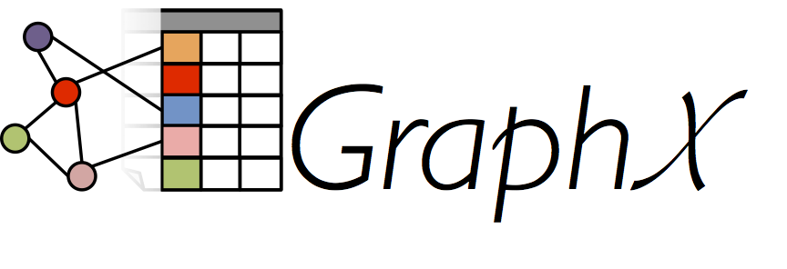
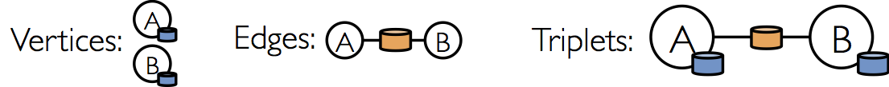
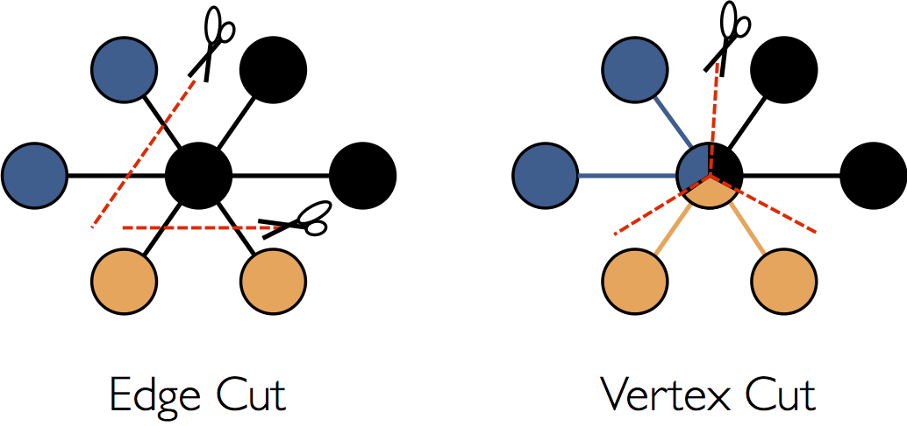
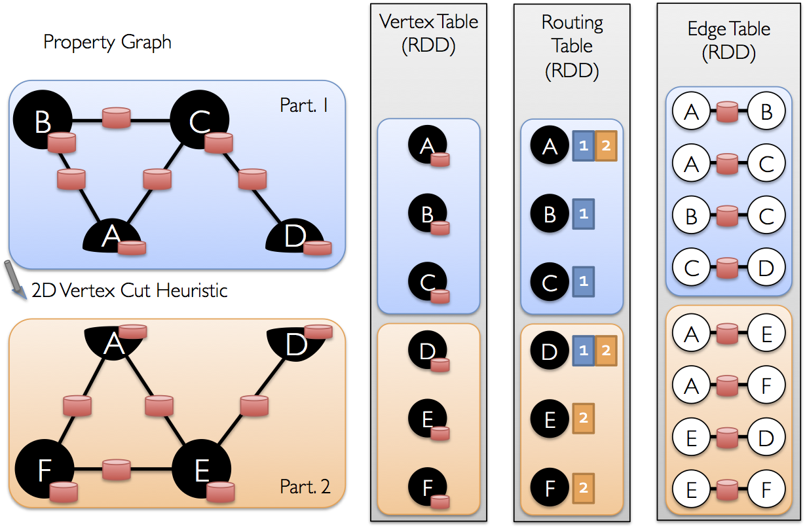

# GraphX

* This will become a table of contents (this text will be scraped). {:toc}



## Overview

GraphX is a new component in Spark for graphs and graph-parallel computation. At a high level, GraphX extends the Spark [RDD](api/scala/org/apache/spark/rdd/RDD.html) by introducing a new [Graph](graphx-programming-guide.md#property_graph) abstraction: a directed multigraph with properties attached to each vertex and edge. To support graph computation, GraphX exposes a set of fundamental operators (e.g., [subgraph](graphx-programming-guide.md#structural_operators), [joinVertices](graphx-programming-guide.md#join_operators), and [aggregateMessages](graphx-programming-guide.md#aggregateMessages)) as well as an optimized variant of the [Pregel](graphx-programming-guide.md#pregel) API. In addition, GraphX includes a growing collection of graph [algorithms](graphx-programming-guide.md#graph_algorithms) and [builders](graphx-programming-guide.md#graph_builders) to simplify graph analytics tasks.

## Getting Started

To get started you first need to import Spark and GraphX into your project, as follows:

If you are not using the Spark shell you will also need a `SparkContext`. To learn more about getting started with Spark refer to the [Spark Quick Start Guide](quick-start.html).

## The Property Graph

The [property graph](api/scala/org/apache/spark/graphx/Graph.html) is a directed multigraph with user defined objects attached to each vertex and edge. A directed multigraph is a directed graph with potentially multiple parallel edges sharing the same source and destination vertex. The ability to support parallel edges simplifies modeling scenarios where there can be multiple relationships (e.g., co-worker and friend) between the same vertices. Each vertex is keyed by a _unique_ 64-bit long identifier (`VertexId`). GraphX does not impose any ordering constraints on the vertex identifiers. Similarly, edges have corresponding source and destination vertex identifiers.

The property graph is parameterized over the vertex (`VD`) and edge (`ED`) types. These are the types of the objects associated with each vertex and edge respectively.

> GraphX optimizes the representation of vertex and edge types when they are primitive data types (e.g., int, double, etc...) reducing the in memory footprint by storing them in specialized arrays.

In some cases it may be desirable to have vertices with different property types in the same graph. This can be accomplished through inheritance. For example to model users and products as a bipartite graph we might do the following:

Like RDDs, property graphs are immutable, distributed, and fault-tolerant. Changes to the values or structure of the graph are accomplished by producing a new graph with the desired changes. Note that substantial parts of the original graph (i.e., unaffected structure, attributes, and indices) are reused in the new graph reducing the cost of this inherently functional data structure. The graph is partitioned across the executors using a range of vertex partitioning heuristics. As with RDDs, each partition of the graph can be recreated on a different machine in the event of a failure.

Logically the property graph corresponds to a pair of typed collections (RDDs) encoding the properties for each vertex and edge. As a consequence, the graph class contains members to access the vertices and edges of the graph:

The classes `VertexRDD[VD]` and `EdgeRDD[ED]` extend and are optimized versions of `RDD[(VertexId, VD)]` and `RDD[Edge[ED]]` respectively. Both `VertexRDD[VD]` and `EdgeRDD[ED]` provide additional functionality built around graph computation and leverage internal optimizations. We discuss the `VertexRDD`[VertexRDD](api/scala/org/apache/spark/graphx/VertexRDD.html) and `EdgeRDD`[EdgeRDD](api/scala/org/apache/spark/graphx/EdgeRDD.html) API in greater detail in the section on [vertex and edge RDDs](graphx-programming-guide.md#vertex_and_edge_rdds) but for now they can be thought of as simply RDDs of the form: `RDD[(VertexId, VD)]` and `RDD[Edge[ED]]`.

#### Example Property Graph

Suppose we want to construct a property graph consisting of the various collaborators on the GraphX project. The vertex property might contain the username and occupation. We could annotate edges with a string describing the relationships between collaborators:


The resulting graph would have the type signature:

There are numerous ways to construct a property graph from raw files, RDDs, and even synthetic generators and these are discussed in more detail in the section on [graph builders](graphx-programming-guide.md#graph_builders). Probably the most general method is to use the [Graph object](api/scala/org/apache/spark/graphx/Graph$.html). For example the following code constructs a graph from a collection of RDDs:

In the above example we make use of the [`Edge`](api/scala/org/apache/spark/graphx/Edge.html) case class. Edges have a `srcId` and a `dstId` corresponding to the source and destination vertex identifiers. In addition, the `Edge` class has an `attr` member which stores the edge property.

We can deconstruct a graph into the respective vertex and edge views by using the `graph.vertices` and `graph.edges` members respectively.

> Note that `graph.vertices` returns an `VertexRDD[(String, String)]` which extends `RDD[(VertexId, (String, String))]` and so we use the scala `case` expression to deconstruct the tuple. On the other hand, `graph.edges` returns an `EdgeRDD` containing `Edge[String]` objects. We could have also used the case class type constructor as in the following:

graph.edges.filter { case Edge(src, dst, prop) => src > dst }.count

In addition to the vertex and edge views of the property graph, GraphX also exposes a triplet view. The triplet view logically joins the vertex and edge properties yielding an `RDD[EdgeTriplet[VD, ED]]` containing instances of the [`EdgeTriplet`](api/scala/org/apache/spark/graphx/EdgeTriplet.html) class. This _join_ can be expressed in the following SQL expression:

or graphically as:



The [`EdgeTriplet`](api/scala/org/apache/spark/graphx/EdgeTriplet.html) class extends the [`Edge`](api/scala/org/apache/spark/graphx/Edge.html) class by adding the `srcAttr` and `dstAttr` members which contain the source and destination properties respectively. We can use the triplet view of a graph to render a collection of strings describing relationships between users.

## Graph Operators

Just as RDDs have basic operations like `map`, `filter`, and `reduceByKey`, property graphs also have a collection of basic operators that take user defined functions and produce new graphs with transformed properties and structure. The core operators that have optimized implementations are defined in [`Graph`](api/scala/org/apache/spark/graphx/Graph$.html) and convenient operators that are expressed as a compositions of the core operators are defined in [`GraphOps`](api/scala/org/apache/spark/graphx/GraphOps.html). However, thanks to Scala implicits the operators in `GraphOps` are automatically available as members of `Graph`. For example, we can compute the in-degree of each vertex (defined in `GraphOps`) by the following:

The reason for differentiating between core graph operations and [`GraphOps`](api/scala/org/apache/spark/graphx/GraphOps.html) is to be able to support different graph representations in the future. Each graph representation must provide implementations of the core operations and reuse many of the useful operations defined in [`GraphOps`](api/scala/org/apache/spark/graphx/GraphOps.html).

#### Summary List of Operators

The following is a quick summary of the functionality defined in both [`Graph`](api/scala/org/apache/spark/graphx/Graph$.html) and [`GraphOps`](api/scala/org/apache/spark/graphx/GraphOps.html) but presented as members of Graph for simplicity. Note that some function signatures have been simplified (e.g., default arguments and type constraints removed) and some more advanced functionality has been removed so please consult the API docs for the official list of operations.

### Property Operators

Like the RDD `map` operator, the property graph contains the following:

Each of these operators yields a new graph with the vertex or edge properties modified by the user defined `map` function.

> Note that in each case the graph structure is unaffected. This is a key feature of these operators which allows the resulting graph to reuse the structural indices of the original graph. The following snippets are logically equivalent, but the first one does not preserve the structural indices and would not benefit from the GraphX system optimizations:

val newVertices = graph.vertices.map { case (id, attr) => (id, mapUdf(id, attr)) } val newGraph = Graph(newVertices, graph.edges)

> Instead, use [`mapVertices`](api/scala/org/apache/spark/graphx/Graph.html#mapVertices\[VD2]\(\(VertexId,VD\)%E2%87%92VD2\)\(ClassTag\[VD2]\):Graph\[VD2,ED]) to preserve the indices:

val newGraph = graph.mapVertices((id, attr) => mapUdf(id, attr))

These operators are often used to initialize the graph for a particular computation or project away unnecessary properties. For example, given a graph with the out degrees as the vertex properties (we describe how to construct such a graph later), we initialize it for PageRank:

### Structural Operators

Currently GraphX supports only a simple set of commonly used structural operators and we expect to add more in the future. The following is a list of the basic structural operators.

The [`reverse`](api/scala/org/apache/spark/graphx/Graph.html#reverse:Graph\[VD,ED]) operator returns a new graph with all the edge directions reversed. This can be useful when, for example, trying to compute the inverse PageRank. Because the reverse operation does not modify vertex or edge properties or change the number of edges, it can be implemented efficiently without data movement or duplication.

The [`subgraph`](api/scala/org/apache/spark/graphx/Graph.html#subgraph\(\(EdgeTriplet\[VD,ED]\)%E2%87%92Boolean,\(VertexId,VD\)%E2%87%92Boolean\):Graph\[VD,ED]) operator takes vertex and edge predicates and returns the graph containing only the vertices that satisfy the vertex predicate (evaluate to true) and edges that satisfy the edge predicate _and connect vertices that satisfy the vertex predicate_. The `subgraph` operator can be used in number of situations to restrict the graph to the vertices and edges of interest or eliminate broken links. For example in the following code we remove broken links:

> Note in the above example only the vertex predicate is provided. The `subgraph` operator defaults to `true` if the vertex or edge predicates are not provided.

The [`mask`](api/scala/org/apache/spark/graphx/Graph.html#mask\[VD2,ED2]\(Graph\[VD2,ED2]\)\(ClassTag\[VD2],ClassTag\[ED2]\):Graph\[VD,ED]) operator constructs a subgraph by returning a graph that contains the vertices and edges that are also found in the input graph. This can be used in conjunction with the `subgraph` operator to restrict a graph based on the properties in another related graph. For example, we might run connected components using the graph with missing vertices and then restrict the answer to the valid subgraph.

The [`groupEdges`](api/scala/org/apache/spark/graphx/Graph.html#groupEdges\(\(ED,ED\)%E2%87%92ED\):Graph\[VD,ED]) operator merges parallel edges (i.e., duplicate edges between pairs of vertices) in the multigraph. In many numerical applications, parallel edges can be _added_ (their weights combined) into a single edge thereby reducing the size of the graph.

### Join Operators

In many cases it is necessary to join data from external collections (RDDs) with graphs. For example, we might have extra user properties that we want to merge with an existing graph or we might want to pull vertex properties from one graph into another. These tasks can be accomplished using the _join_ operators. Below we list the key join operators:

The [`joinVertices`](api/scala/org/apache/spark/graphx/GraphOps.html#joinVertices\[U]\(RDD\[\(VertexId,U\)]\)\(\(VertexId,VD,U\)%E2%87%92VD\)\(ClassTag\[U]\):Graph\[VD,ED]) operator joins the vertices with the input RDD and returns a new graph with the vertex properties obtained by applying the user defined `map` function to the result of the joined vertices. Vertices without a matching value in the RDD retain their original value.

> Note that if the RDD contains more than one value for a given vertex only one will be used. It is therefore recommended that the input RDD be made unique using the following which will also _pre-index_ the resulting values to substantially accelerate the subsequent join.

val nonUniqueCosts: RDD\[(VertexId, Double)] val uniqueCosts: VertexRDD\[Double] = graph.vertices.aggregateUsingIndex(nonUnique, (a,b) => a + b) val joinedGraph = graph.joinVertices(uniqueCosts)( (id, oldCost, extraCost) => oldCost + extraCost)

The more general [`outerJoinVertices`](api/scala/org/apache/spark/graphx/Graph.html#outerJoinVertices\[U,VD2]\(RDD\[\(VertexId,U\)]\)\(\(VertexId,VD,Option\[U]\)%E2%87%92VD2\)\(ClassTag\[U],ClassTag\[VD2]\):Graph\[VD2,ED]) behaves similarly to `joinVertices` except that the user defined `map` function is applied to all vertices and can change the vertex property type. Because not all vertices may have a matching value in the input RDD the `map` function takes an `Option` type. For example, we can set up a graph for PageRank by initializing vertex properties with their `outDegree`.

> You may have noticed the multiple parameter lists (e.g., `f(a)(b)`) curried function pattern used in the above examples. While we could have equally written `f(a)(b)` as `f(a,b)` this would mean that type inference on `b` would not depend on `a`. As a consequence, the user would need to provide type annotation for the user defined function:

val joinedGraph = graph.joinVertices(uniqueCosts, (id: VertexId, oldCost: Double, extraCost: Double) => oldCost + extraCost)

>

Neighborhood AggregationA key step in many graph analytics tasks is aggregating information about the neighborhood of each vertex. For example, we might want to know the number of followers each user has or the average age of the followers of each user. Many iterative graph algorithms (e.g., PageRank, Shortest Path, and connected components) repeatedly aggregate properties of neighboring vertices (e.g., current PageRank Value, shortest path to the source, and smallest reachable vertex id).To improve performance the primary aggregation operator changed from `graph.mapReduceTriplets` to the new `graph.AggregateMessages`. While the changes in the API are relatively small, we provide a transition guide below.

#### Aggregate Messages (aggregateMessages)

The core aggregation operation in GraphX is [`aggregateMessages`](api/scala/org/apache/spark/graphx/Graph.html#aggregateMessages\[A]\(\(EdgeContext\[VD,ED,A]\)%E2%87%92Unit,\(A,A\)%E2%87%92A,TripletFields\)\(ClassTag\[A]\):VertexRDD\[A]). This operator applies a user defined `sendMsg` function to each _edge triplet_ in the graph and then uses the `mergeMsg` function to aggregate those messages at their destination vertex.

The user defined `sendMsg` function takes an [`EdgeContext`](api/scala/org/apache/spark/graphx/EdgeContext.html), which exposes the source and destination attributes along with the edge attribute and functions ([`sendToSrc`](api/scala/org/apache/spark/graphx/EdgeContext.html#sendToSrc\(msg:A\):Unit), and [`sendToDst`](api/scala/org/apache/spark/graphx/EdgeContext.html#sendToDst\(msg:A\):Unit)) to send messages to the source and destination attributes. Think of `sendMsg` as the _map_ function in map-reduce. The user defined `mergeMsg` function takes two messages destined to the same vertex and yields a single message. Think of `mergeMsg` as the _reduce_ function in map-reduce. The [`aggregateMessages`](api/scala/org/apache/spark/graphx/Graph.html#aggregateMessages\[A]\(\(EdgeContext\[VD,ED,A]\)%E2%87%92Unit,\(A,A\)%E2%87%92A,TripletFields\)\(ClassTag\[A]\):VertexRDD\[A]) operator returns a `VertexRDD[Msg]` containing the aggregate message (of type `Msg`) destined to each vertex. Vertices that did not receive a message are not included in the returned `VertexRDD`[VertexRDD](api/scala/org/apache/spark/graphx/VertexRDD.html).

In addition, [`aggregateMessages`](api/scala/org/apache/spark/graphx/Graph.html#aggregateMessages\[A]\(\(EdgeContext\[VD,ED,A]\)%E2%87%92Unit,\(A,A\)%E2%87%92A,TripletFields\)\(ClassTag\[A]\):VertexRDD\[A]) takes an optional `tripletsFields` which indicates what data is accessed in the [`EdgeContext`](api/scala/org/apache/spark/graphx/EdgeContext.html) (i.e., the source vertex attribute but not the destination vertex attribute). The possible options for the `tripletsFields` are defined in [`TripletFields`](api/java/org/apache/spark/graphx/TripletFields.html) and the default value is [`TripletFields.All`](api/java/org/apache/spark/graphx/TripletFields.html#All) which indicates that the user defined `sendMsg` function may access any of the fields in the [`EdgeContext`](api/scala/org/apache/spark/graphx/EdgeContext.html). The `tripletFields` argument can be used to notify GraphX that only part of the [`EdgeContext`](api/scala/org/apache/spark/graphx/EdgeContext.html) will be needed allowing GraphX to select an optimized join strategy. For example if we are computing the average age of the followers of each user we would only require the source field and so we would use [`TripletFields.Src`](api/java/org/apache/spark/graphx/TripletFields.html#Src) to indicate that we only require the source field

> In earlier versions of GraphX we used byte code inspection to infer the [`TripletFields`](api/java/org/apache/spark/graphx/TripletFields.html) however we have found that bytecode inspection to be slightly unreliable and instead opted for more explicit user control.

In the following example we use the [`aggregateMessages`](api/scala/org/apache/spark/graphx/Graph.html#aggregateMessages\[A]\(\(EdgeContext\[VD,ED,A]\)%E2%87%92Unit,\(A,A\)%E2%87%92A,TripletFields\)\(ClassTag\[A]\):VertexRDD\[A]) operator to compute the average age of the more senior followers of each user.

> The `aggregateMessages` operation performs optimally when the messages (and the sums of messages) are constant sized (e.g., floats and addition instead of lists and concatenation).

#### Map Reduce Triplets Transition Guide (Legacy)

In earlier versions of GraphX neighborhood aggregation was accomplished using the `mapReduceTriplets` operator:

The `mapReduceTriplets` operator takes a user defined map function which is applied to each triplet and can yield _messages_ which are aggregated using the user defined `reduce` function. However, we found the user of the returned iterator to be expensive and it inhibited our ability to apply additional optimizations (e.g., local vertex renumbering). In [`aggregateMessages`](api/scala/org/apache/spark/graphx/Graph.html#aggregateMessages\[A]\(\(EdgeContext\[VD,ED,A]\)%E2%87%92Unit,\(A,A\)%E2%87%92A,TripletFields\)\(ClassTag\[A]\):VertexRDD\[A]) we introduced the EdgeContext which exposes the triplet fields and also functions to explicitly send messages to the source and destination vertex. Furthermore we removed bytecode inspection and instead require the user to indicate what fields in the triplet are actually required.

The following code block using `mapReduceTriplets`:

can be rewritten using `aggregateMessages` as:

#### Computing Degree Information

A common aggregation task is computing the degree of each vertex: the number of edges adjacent to each vertex. In the context of directed graphs it is often necessary to know the in-degree, out-degree, and the total degree of each vertex. The [`GraphOps`](api/scala/org/apache/spark/graphx/GraphOps.html) class contains a collection of operators to compute the degrees of each vertex. For example in the following we compute the max in, out, and total degrees:

#### Collecting Neighbors

In some cases it may be easier to express computation by collecting neighboring vertices and their attributes at each vertex. This can be easily accomplished using the [`collectNeighborIds`](api/scala/org/apache/spark/graphx/GraphOps.html#collectNeighborIds\(EdgeDirection\):VertexRDD\[Array\[VertexId]]) and the [`collectNeighbors`](api/scala/org/apache/spark/graphx/GraphOps.html#collectNeighbors\(EdgeDirection\):VertexRDD\[Array\[\(VertexId,VD\)]]) operators.

> These operators can be quite costly as they duplicate information and require substantial communication. If possible try expressing the same computation using the [`aggregateMessages`](api/scala/org/apache/spark/graphx/Graph.html#aggregateMessages\[A]\(\(EdgeContext\[VD,ED,A]\)%E2%87%92Unit,\(A,A\)%E2%87%92A,TripletFields\)\(ClassTag\[A]\):VertexRDD\[A]) operator directly.

### Caching and Uncaching

In Spark, RDDs are not persisted in memory by default. To avoid recomputation, they must be explicitly cached when using them multiple times (see the [Spark Programming Guide](rdd-programming-guide.html#rdd-persistence)). Graphs in GraphX behave the same way. **When using a graph multiple times, make sure to call** [**`Graph.cache()`**](api/scala/org/apache/spark/graphx/Graph.html#cache\(\):Graph\[VD,ED]) **on it first.**

In iterative computations, _uncaching_ may also be necessary for best performance. By default, cached RDDs and graphs will remain in memory until memory pressure forces them to be evicted in LRU order. For iterative computation, intermediate results from previous iterations will fill up the cache. Though they will eventually be evicted, the unnecessary data stored in memory will slow down garbage collection. It would be more efficient to uncache intermediate results as soon as they are no longer necessary. This involves materializing (caching and forcing) a graph or RDD every iteration, uncaching all other datasets, and only using the materialized dataset in future iterations. However, because graphs are composed of multiple RDDs, it can be difficult to unpersist them correctly. **For iterative computation we recommend using the Pregel API, which correctly unpersists intermediate results.**

## Pregel API

Graphs are inherently recursive data structures as properties of vertices depend on properties of their neighbors which in turn depend on properties of _their_ neighbors. As a consequence many important graph algorithms iteratively recompute the properties of each vertex until a fixed-point condition is reached. A range of graph-parallel abstractions have been proposed to express these iterative algorithms. GraphX exposes a variant of the Pregel API.

At a high level the Pregel operator in GraphX is a bulk-synchronous parallel messaging abstraction _constrained to the topology of the graph_. The Pregel operator executes in a series of super steps in which vertices receive the _sum_ of their inbound messages from the previous super step, compute a new value for the vertex property, and then send messages to neighboring vertices in the next super step. Unlike Pregel, messages are computed in parallel as a function of the edge triplet and the message computation has access to both the source and destination vertex attributes. Vertices that do not receive a message are skipped within a super step. The Pregel operator terminates iteration and returns the final graph when there are no messages remaining.

> Note, unlike more standard Pregel implementations, vertices in GraphX can only send messages to neighboring vertices and the message construction is done in parallel using a user defined messaging function. These constraints allow additional optimization within GraphX.

The following is the type signature of the [Pregel operator](api/scala/org/apache/spark/graphx/GraphOps.html#pregel\[A]\(A,Int,EdgeDirection\)\(\(VertexId,VD,A\)%E2%87%92VD,\(EdgeTriplet\[VD,ED]\)%E2%87%92Iterator\[\(VertexId,A\)],\(A,A\)%E2%87%92A\)\(ClassTag\[A]\):Graph\[VD,ED]) as well as a _sketch_ of its implementation (note: to avoid stackOverflowError due to long lineage chains, pregel support periodically checkpoint graph and messages by setting "spark.graphx.pregel.checkpointInterval" to a positive number, say 10. And set checkpoint directory as well using SparkContext.setCheckpointDir(directory: String)):

Notice that Pregel takes two argument lists (i.e., `graph.pregel(list1)(list2)`). The first argument list contains configuration parameters including the initial message, the maximum number of iterations, and the edge direction in which to send messages (by default along out edges). The second argument list contains the user defined functions for receiving messages (the vertex program `vprog`), computing messages (`sendMsg`), and combining messages `mergeMsg`.

We can use the Pregel operator to express computation such as single source shortest path in the following example.

## Graph Builders

GraphX provides several ways of building a graph from a collection of vertices and edges in an RDD or on disk. None of the graph builders repartitions the graph's edges by default; instead, edges are left in their default partitions (such as their original blocks in HDFS). [`Graph.groupEdges`](api/scala/org/apache/spark/graphx/Graph.html#groupEdges\(\(ED,ED\)%E2%87%92ED\):Graph\[VD,ED]) requires the graph to be repartitioned because it assumes identical edges will be colocated on the same partition, so you must call [`Graph.partitionBy`](api/scala/org/apache/spark/graphx/Graph.html#partitionBy\(PartitionStrategy\):Graph\[VD,ED]) before calling `groupEdges`.

[`GraphLoader.edgeListFile`](api/scala/org/apache/spark/graphx/GraphLoader$.html#edgeListFile\(SparkContext,String,Boolean,Int\):Graph\[Int,Int]) provides a way to load a graph from a list of edges on disk. It parses an adjacency list of (source vertex ID, destination vertex ID) pairs of the following form, skipping comment lines that begin with `#`:

```
# This is a comment
2 1
4 1
1 2
```

It creates a `Graph` from the specified edges, automatically creating any vertices mentioned by edges. All vertex and edge attributes default to 1. The `canonicalOrientation` argument allows reorienting edges in the positive direction (`srcId < dstId`), which is required by the [connected components](api/scala/org/apache/spark/graphx/lib/ConnectedComponents$.html) algorithm. The `minEdgePartitions` argument specifies the minimum number of edge partitions to generate; there may be more edge partitions than specified if, for example, the HDFS file has more blocks.

[`Graph.apply`](api/scala/org/apache/spark/graphx/Graph$.html#apply\[VD,ED]\(RDD\[\(VertexId,VD\)],RDD\[Edge\[ED]],VD\)\(ClassTag\[VD],ClassTag\[ED]\):Graph\[VD,ED]) allows creating a graph from RDDs of vertices and edges. Duplicate vertices are picked arbitrarily and vertices found in the edge RDD but not the vertex RDD are assigned the default attribute.

[`Graph.fromEdges`](api/scala/org/apache/spark/graphx/Graph$.html#fromEdges\[VD,ED]\(RDD\[Edge\[ED]],VD\)\(ClassTag\[VD],ClassTag\[ED]\):Graph\[VD,ED]) allows creating a graph from only an RDD of edges, automatically creating any vertices mentioned by edges and assigning them the default value.

[`Graph.fromEdgeTuples`](api/scala/org/apache/spark/graphx/Graph$.html#fromEdgeTuples\[VD]\(RDD\[\(VertexId,VertexId\)],VD,Option\[PartitionStrategy]\)\(ClassTag\[VD]\):Graph\[VD,Int]) allows creating a graph from only an RDD of edge tuples, assigning the edges the value 1, and automatically creating any vertices mentioned by edges and assigning them the default value. It also supports deduplicating the edges; to deduplicate, pass `Some` of a [`PartitionStrategy`](api/scala/org/apache/spark/graphx/PartitionStrategy$.html) as the `uniqueEdges` parameter (for example, `uniqueEdges = Some(PartitionStrategy.RandomVertexCut)`). A partition strategy is necessary to colocate identical edges on the same partition so they can be deduplicated.

## Vertex and Edge RDDs

GraphX exposes `RDD` views of the vertices and edges stored within the graph. However, because GraphX maintains the vertices and edges in optimized data structures and these data structures provide additional functionality, the vertices and edges are returned as `VertexRDD`[VertexRDD](api/scala/org/apache/spark/graphx/VertexRDD.html) and `EdgeRDD`[EdgeRDD](api/scala/org/apache/spark/graphx/EdgeRDD.html) respectively. In this section we review some of the additional useful functionality in these types. Note that this is just an incomplete list, please refer to the API docs for the official list of operations.

### VertexRDDs

The `VertexRDD[A]` extends `RDD[(VertexId, A)]` and adds the additional constraint that each `VertexId` occurs only _once_. Moreover, `VertexRDD[A]` represents a _set_ of vertices each with an attribute of type `A`. Internally, this is achieved by storing the vertex attributes in a reusable hash-map data-structure. As a consequence if two `VertexRDD`s are derived from the same base `VertexRDD`[VertexRDD](api/scala/org/apache/spark/graphx/VertexRDD.html) (e.g., by `filter` or `mapValues`) they can be joined in constant time without hash evaluations. To leverage this indexed data structure, the `VertexRDD`[VertexRDD](api/scala/org/apache/spark/graphx/VertexRDD.html) exposes the following additional functionality:

Notice, for example, how the `filter` operator returns a `VertexRDD`[VertexRDD](api/scala/org/apache/spark/graphx/VertexRDD.html). Filter is actually implemented using a `BitSet` thereby reusing the index and preserving the ability to do fast joins with other `VertexRDD`s. Likewise, the `mapValues` operators do not allow the `map` function to change the `VertexId` thereby enabling the same `HashMap` data structures to be reused. Both the `leftJoin` and `innerJoin` are able to identify when joining two `VertexRDD`s derived from the same `HashMap` and implement the join by linear scan rather than costly point lookups.

The `aggregateUsingIndex` operator is useful for efficient construction of a new `VertexRDD`[VertexRDD](api/scala/org/apache/spark/graphx/VertexRDD.html) from an `RDD[(VertexId, A)]`. Conceptually, if I have constructed a `VertexRDD[B]` over a set of vertices, _which is a super-set_ of the vertices in some `RDD[(VertexId, A)]` then I can reuse the index to both aggregate and then subsequently index the `RDD[(VertexId, A)]`. For example:

### EdgeRDDs

The `EdgeRDD[ED]`, which extends `RDD[Edge[ED]]` organizes the edges in blocks partitioned using one of the various partitioning strategies defined in [`PartitionStrategy`](api/scala/org/apache/spark/graphx/PartitionStrategy$.html). Within each partition, edge attributes and adjacency structure, are stored separately enabling maximum reuse when changing attribute values.

The three additional functions exposed by the `EdgeRDD`[EdgeRDD](api/scala/org/apache/spark/graphx/EdgeRDD.html) are:

In most applications we have found that operations on the `EdgeRDD`[EdgeRDD](api/scala/org/apache/spark/graphx/EdgeRDD.html) are accomplished through the graph operators or rely on operations defined in the base `RDD` class.

## Optimized Representation

While a detailed description of the optimizations used in the GraphX representation of distributed graphs is beyond the scope of this guide, some high-level understanding may aid in the design of scalable algorithms as well as optimal use of the API. GraphX adopts a vertex-cut approach to distributed graph partitioning:



Rather than splitting graphs along edges, GraphX partitions the graph along vertices which can reduce both the communication and storage overhead. Logically, this corresponds to assigning edges to machines and allowing vertices to span multiple machines. The exact method of assigning edges depends on the [`PartitionStrategy`](api/scala/org/apache/spark/graphx/PartitionStrategy$.html) and there are several tradeoffs to the various heuristics. Users can choose between different strategies by repartitioning the graph with the [`Graph.partitionBy`](api/scala/org/apache/spark/graphx/Graph.html#partitionBy\(PartitionStrategy\):Graph\[VD,ED]) operator. The default partitioning strategy is to use the initial partitioning of the edges as provided on graph construction. However, users can easily switch to 2D-partitioning or other heuristics included in GraphX.



Once the edges have been partitioned the key challenge to efficient graph-parallel computation is efficiently joining vertex attributes with the edges. Because real-world graphs typically have more edges than vertices, we move vertex attributes to the edges. Because not all partitions will contain edges adjacent to all vertices we internally maintain a routing table which identifies where to broadcast vertices when implementing the join required for operations like `triplets` and `aggregateMessages`.

## Graph Algorithms

GraphX includes a set of graph algorithms to simplify analytics tasks. The algorithms are contained in the `org.apache.spark.graphx.lib` package and can be accessed directly as methods on `Graph` via [`GraphOps`](api/scala/org/apache/spark/graphx/GraphOps.html). This section describes the algorithms and how they are used.

### PageRank

PageRank measures the importance of each vertex in a graph, assuming an edge from _u_ to _v_ represents an endorsement of _v_'s importance by _u_. For example, if a Twitter user is followed by many others, the user will be ranked highly.

GraphX comes with static and dynamic implementations of PageRank as methods on the [`PageRank` object](api/scala/org/apache/spark/graphx/lib/PageRank$.html). Static PageRank runs for a fixed number of iterations, while dynamic PageRank runs until the ranks converge (i.e., stop changing by more than a specified tolerance). [`GraphOps`](api/scala/org/apache/spark/graphx/GraphOps.html) allows calling these algorithms directly as methods on `Graph`.

GraphX also includes an example social network dataset that we can run PageRank on. A set of users is given in `data/graphx/users.txt`, and a set of relationships between users is given in `data/graphx/followers.txt`. We compute the PageRank of each user as follows:

### Connected Components

The connected components algorithm labels each connected component of the graph with the ID of its lowest-numbered vertex. For example, in a social network, connected components can approximate clusters. GraphX contains an implementation of the algorithm in the [`ConnectedComponents` object](api/scala/org/apache/spark/graphx/lib/ConnectedComponents$.html), and we compute the connected components of the example social network dataset from the [PageRank section](graphx-programming-guide.md#pagerank) as follows:

### Triangle Counting

A vertex is part of a triangle when it has two adjacent vertices with an edge between them. GraphX implements a triangle counting algorithm in the [`TriangleCount` object](api/scala/org/apache/spark/graphx/lib/TriangleCount$.html) that determines the number of triangles passing through each vertex, providing a measure of clustering. We compute the triangle count of the social network dataset from the [PageRank section](graphx-programming-guide.md#pagerank). _Note that `TriangleCount` requires the edges to be in canonical orientation (`srcId < dstId`) and the graph to be partitioned using_ [_`Graph.partitionBy`_](api/scala/org/apache/spark/graphx/Graph.html#partitionBy\(PartitionStrategy\):Graph\[VD,ED])_._

## Examples

Suppose I want to build a graph from some text files, restrict the graph to important relationships and users, run page-rank on the subgraph, and then finally return attributes associated with the top users. I can do all of this in just a few lines with GraphX:
