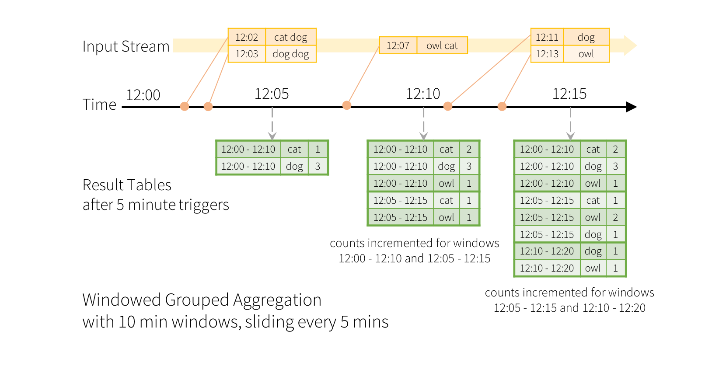
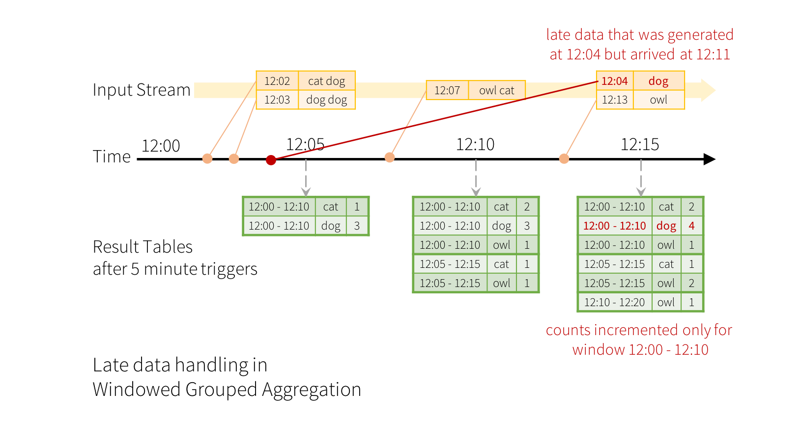
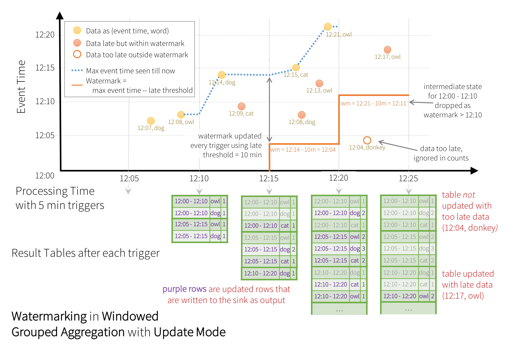
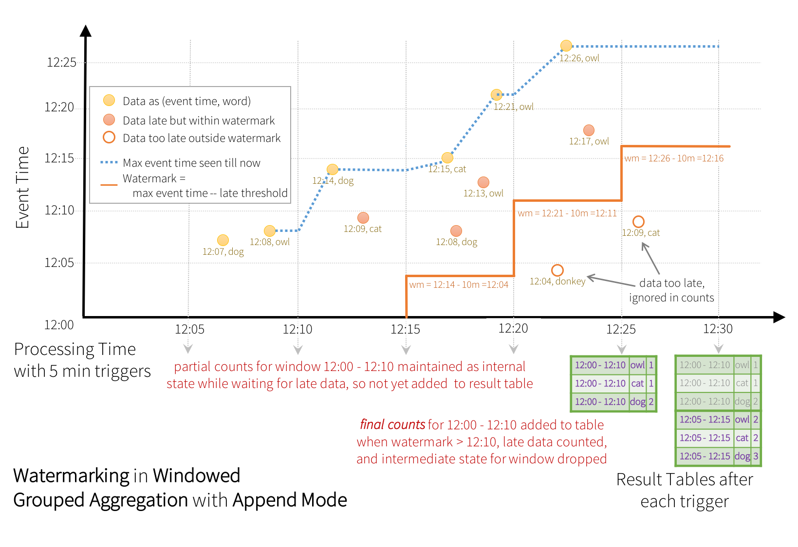
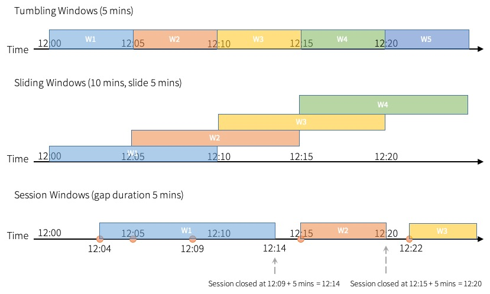

# API using Datasets and DataFrames

Since Spark 2.0, DataFrames and Datasets can represent static, bounded data, as well as streaming, unbounded data. Similar to static Datasets/DataFrames, you can use the common entry point `SparkSession` ([Python](../../api/python/reference/pyspark.sql/api/pyspark.sql.SparkSession.html#pyspark.sql.SparkSession)/[Scala](../../api/scala/org/apache/spark/sql/SparkSession.html)/[Java](../../api/java/org/apache/spark/sql/SparkSession.html)/[R](../../api/R/reference/sparkR.session.html) docs) to create streaming DataFrames/Datasets from streaming sources, and apply the same operations on them as static DataFrames/Datasets. If you are not familiar with Datasets/DataFrames, you are strongly advised to familiarize yourself with them using the [DataFrame/Dataset Programming Guide](../sql-programming-guide.html).

## Creating streaming DataFrames and streaming Datasets

Streaming DataFrames can be created through the `DataStreamReader` interface ([Python](../../api/python/reference/pyspark.ss/api/pyspark.sql.streaming.DataStreamReader.html#pyspark.sql.streaming.DataStreamReader)/[Scala](../../api/scala/org/apache/spark/sql/streaming/DataStreamReader.html)/[Java](../../api/java/org/apache/spark/sql/streaming/DataStreamReader.html) docs) returned by `SparkSession.readStream()`. In [R](../../api/R/reference/read.stream.html), with the `read.stream()` method. Similar to the read interface for creating static DataFrame, you can specify the details of the source – data format, schema, options, etc.

#### Input Sources

There are a few built-in sources.

* **File source** - Reads files written in a directory as a stream of data. Files will be processed in the order of file modification time. If `latestFirst` is set, order will be reversed. Supported file formats are text, CSV, JSON, ORC, Parquet. See the docs of the DataStreamReader interface for a more up-to-date list, and supported options for each file format. Note that the files must be atomically placed in the given directory, which in most file systems, can be achieved by file move operations.
* **Kafka source** - Reads data from Kafka. It's compatible with Kafka broker versions 0.10.0 or higher. See the [Kafka Integration Guide](structured-streaming-kafka-integration.html) for more details.
* **Socket source (for testing)** - Reads UTF8 text data from a socket connection. The listening server socket is at the driver. Note that this should be used only for testing as this does not provide end-to-end fault-tolerance guarantees.
* **Rate source (for testing)** - Generates data at the specified number of rows per second, each output row contains a `timestamp` and `value`. Where `timestamp` is a `Timestamp` type containing the time of message dispatch, and `value` is of `Long` type containing the message count, starting from 0 as the first row. This source is intended for testing and benchmarking.
* **Rate Per Micro-Batch source (for testing)** - Generates data at the specified number of rows per micro-batch, each output row contains a `timestamp` and `value`. Where `timestamp` is a `Timestamp` type containing the time of message dispatch, and `value` is of `Long` type containing the message count, starting from 0 as the first row. Unlike `rate` data source, this data source provides a consistent set of input rows per micro-batch regardless of query execution (configuration of trigger, query being lagging, etc.), say, batch 0 will produce 0~~999 and batch 1 will produce 1000~~1999, and so on. Same applies to the generated time. This source is intended for testing and benchmarking.

Some sources are not fault-tolerant because they do not guarantee that data can be replayed using checkpointed offsets after a failure. See the earlier section on [fault-tolerance semantics](getting-started.html#fault-tolerance-semantics) Here are the details of all the sources in Spark.

<table><thead><tr><th>Source</th><th>Options</th><th>Fault-tolerant</th><th>Notes</th></tr></thead><tbody><tr><td>File source</td><td><code>path</code>: path to the input directory, and common to all file formats. <code>maxFilesPerTrigger</code>: maximum number of new files to be considered in every trigger (default: no max) <code>maxBytesPerTrigger</code>: maximum total size of new files to be considered in every trigger (default: no max). <code>maxBytesPerTrigger</code> and <code>maxFilesPerTrigger</code> can't both be set at the same time, only one of two must be chosen. Note that a stream always reads at least one file so it can make progress and not get stuck on a file larger than a given maximum. <code>latestFirst</code>: whether to process the latest new files first, useful when there is a large backlog of files (default: false) <code>fileNameOnly</code>: whether to check new files based on only the filename instead of on the full path (default: false). With this set to `true`, the following files would be considered as the same file, because their filenames, "dataset.txt", are the same: "file:///dataset.txt" "s3://a/dataset.txt" "s3n://a/b/dataset.txt" "s3a://a/b/c/dataset.txt" <code>maxFileAge</code>: Maximum age of a file that can be found in this directory, before it is ignored. For the first batch all files will be considered valid. If <code>latestFirst</code> is set to `true` and <code>maxFilesPerTrigger</code> or <code>maxBytesPerTrigger</code> is set, then this parameter will be ignored, because old files that are valid, and should be processed, may be ignored. The max age is specified with respect to the timestamp of the latest file, and not the timestamp of the current system.(default: 1 week) <code>maxCachedFiles</code>: maximum number of files to cache to be processed in subsequent batches (default: 10000). If files are available in the cache, they will be read from first before listing from the input source. <code>discardCachedInputRatio</code>: ratio of cached files/bytes to max files/bytes to allow for listing from input source when there is less cached input than could be available to be read (default: 0.2). For example, if there are only 10 cached files remaining for a batch but the <code>maxFilesPerTrigger</code> is set to 100, the 10 cached files would be discarded and a new listing would be performed instead. Similarly, if there are cached files that are 10 MB remaining for a batch, but the <code>maxBytesPerTrigger</code> is set to 100MB, the cached files would be discarded. <code>cleanSource</code>: option to clean up completed files after processing. Available options are "archive", "delete", "off". If the option is not provided, the default value is "off". When "archive" is provided, additional option <code>sourceArchiveDir</code> must be provided as well. The value of "sourceArchiveDir" must not match with source pattern in depth (the number of directories from the root directory), where the depth is minimum of depth on both paths. This will ensure archived files are never included as new source files. For example, suppose you provide '/hello?/spark/*' as source pattern, '/hello1/spark/archive/dir' cannot be used as the value of "sourceArchiveDir", as '/hello?/spark/*' and '/hello1/spark/archive' will be matched. '/hello1/spark' cannot be also used as the value of "sourceArchiveDir", as '/hello?/spark' and '/hello1/spark' will be matched. '/archived/here' would be OK as it doesn't match. Spark will move source files respecting their own path. For example, if the path of source file is <code>/a/b/dataset.txt</code> and the path of archive directory is <code>/archived/here</code>, file will be moved to <code>/archived/here/a/b/dataset.txt</code>. NOTE: Both archiving (via moving) or deleting completed files will introduce overhead (slow down, even if it's happening in separate thread) in each micro-batch, so you need to understand the cost for each operation in your file system before enabling this option. On the other hand, enabling this option will reduce the cost to list source files which can be an expensive operation. Number of threads used in completed file cleaner can be configured with <code>spark.sql.streaming.fileSource.cleaner.numThreads</code> (default: 1). NOTE 2: The source path should not be used from multiple sources or queries when enabling this option. Similarly, you must ensure the source path doesn't match to any files in output directory of file stream sink. NOTE 3: Both delete and move actions are best effort. Failing to delete or move files will not fail the streaming query. Spark may not clean up some source files in some circumstances - e.g. the application doesn't shut down gracefully, too many files are queued to clean up.  For file-format-specific options, see the related methods in <code>DataStreamReader</code> (<a href="api/python/reference/pyspark.sql/api/pyspark.sql.streaming.DataStreamReader.html#pyspark.sql.streaming.DataStreamReader">Python</a>/<a href="api/scala/org/apache/spark/sql/streaming/DataStreamReader.html">Scala</a>/<a href="api/java/org/apache/spark/sql/streaming/DataStreamReader.html">Java</a>/<a href="api/R/read.stream.html">R</a>). E.g. for "parquet" format options see <code>DataStreamReader.parquet()</code>.  In addition, there are session configurations that affect certain file-formats. See the <a href="../sql-programming-guide.html">SQL Programming Guide</a> for more details. E.g., for "parquet", see <a href="../sql-data-sources-parquet.html#configuration">Parquet configuration</a> section.</td><td>Yes</td><td>Supports glob paths, but does not support multiple comma-separated paths/globs.</td></tr><tr><td>Socket Source</td><td><code>host</code>: host to connect to, must be specified <code>port</code>: port to connect to, must be specified</td><td>No</td><td></td></tr><tr><td>Rate Source</td><td>
<code>rowsPerSecond</code> (e.g. 100, default: 1): How many rows should be generated per second.  <code>rampUpTime</code> (e.g. 5s, default: 0s): How long to ramp up before the generating speed becomes <code>rowsPerSecond</code>. Using finer granularities than seconds will be truncated to integer seconds.  <code>numPartitions</code> (e.g. 10, default: Spark's default parallelism): The partition number for the generated rows.  
<pre><code>    The source will try its best to reach &#x3C;code>rowsPerSecond&#x3C;/code>, but the query may be resource constrained, and &#x3C;code>numPartitions&#x3C;/code> can be tweaked to help reach the desired speed.
&#x3C;/td>
&#x3C;td>Yes&#x3C;/td>
&#x3C;td>&#x3C;/td>
</code></pre></td><td></td><td></td></tr><tr><td>Rate Per Micro-Batch Source (format: rate-micro-batch)</td><td><code>rowsPerBatch</code> (e.g. 100): How many rows should be generated per micro-batch.  <code>numPartitions</code> (e.g. 10, default: Spark's default parallelism): The partition number for the generated rows.  <code>startTimestamp</code> (e.g. 1000, default: 0): starting value of generated time.  <code>advanceMillisPerBatch</code> (e.g. 1000, default: 1000): the amount of time being advanced in generated time on each micro-batch.  </td><td>Yes</td><td></td></tr><tr><td>Kafka Source</td><td>See the <a href="structured-streaming-kafka-integration.html">Kafka Integration Guide</a>.</td><td>Yes</td><td></td></tr><tr><td></td><td></td><td></td><td></td></tr></tbody></table>

Here are some examples.

These examples generate streaming DataFrames that are untyped, meaning that the schema of the DataFrame is not checked at compile time, only checked at runtime when the query is submitted. Some operations like `map`, `flatMap`, etc. need the type to be known at compile time. To do those, you can convert these untyped streaming DataFrames to typed streaming Datasets using the same methods as static DataFrame. See the [SQL Programming Guide](../sql-programming-guide.html) for more details. Additionally, more details on the supported streaming sources are discussed later in the document.

Since Spark 3.1, you can also create streaming DataFrames from tables with `DataStreamReader.table()`. See [Streaming Table APIs](apis-on-dataframes-and-datasets.md#streaming-table-apis) for more details.

### Schema inference and partition of streaming DataFrames/Datasets

By default, Structured Streaming from file based sources requires you to specify the schema, rather than rely on Spark to infer it automatically. This restriction ensures a consistent schema will be used for the streaming query, even in the case of failures. For ad-hoc use cases, you can reenable schema inference by setting `spark.sql.streaming.schemaInference` to `true`.

Partition discovery does occur when subdirectories that are named `/key=value/` are present and listing will automatically recurse into these directories. If these columns appear in the user-provided schema, they will be filled in by Spark based on the path of the file being read. The directories that make up the partitioning scheme must be present when the query starts and must remain static. For example, it is okay to add `/data/year=2016/` when `/data/year=2015/` was present, but it is invalid to change the partitioning column (i.e. by creating the directory `/data/date=2016-04-17/`).

## Operations on streaming DataFrames/Datasets

You can apply all kinds of operations on streaming DataFrames/Datasets – ranging from untyped, SQL-like operations (e.g. `select`, `where`, `groupBy`), to typed RDD-like operations (e.g. `map`, `filter`, `flatMap`). See the [SQL programming guide](../sql-programming-guide.html) for more details. Let’s take a look at a few example operations that you can use.

### Basic Operations - Selection, Projection, Aggregation

Most of the common operations on DataFrame/Dataset are supported for streaming. The few operations that are not supported are [discussed later](apis-on-dataframes-and-datasets.md#unsupported-operations) in this section.

You can also register a streaming DataFrame/Dataset as a temporary view and then apply SQL commands on it.

Note, you can identify whether a DataFrame/Dataset has streaming data or not by using `df.isStreaming`.

You may want to check the query plan of the query, as Spark could inject stateful operations during interpret of SQL statement against streaming dataset. Once stateful operations are injected in the query plan, you may need to check your query with considerations in stateful operations. (e.g. output mode, watermark, state store size maintenance, etc.)

### Window Operations on Event Time

Aggregations over a sliding event-time window are straightforward with Structured Streaming and are very similar to grouped aggregations. In a grouped aggregation, aggregate values (e.g. counts) are maintained for each unique value in the user-specified grouping column. In case of window-based aggregations, aggregate values are maintained for each window the event-time of a row falls into. Let's understand this with an illustration.

Imagine our [quick example](getting-started.html#quick-example) is modified and the stream now contains lines along with the time when the line was generated. Instead of running word counts, we want to count words within 10 minute windows, updating every 5 minutes. That is, word counts in words received between 10 minute windows 12:00 - 12:10, 12:05 - 12:15, 12:10 - 12:20, etc. Note that 12:00 - 12:10 means data that arrived after 12:00 but before 12:10. Now, consider a word that was received at 12:07. This word should increment the counts corresponding to two windows 12:00 - 12:10 and 12:05 - 12:15. So the counts will be indexed by both, the grouping key (i.e. the word) and the window (can be calculated from the event-time).

The result tables would look something like the following.

Since this windowing is similar to grouping, in code, you can use `groupBy()` and `window()` operations to express windowed aggregations. You can see the full code for the below examples in [Python](%7B%7Bsite.SPARK_GITHUB_URL%7D%7D/blob/v%7B%7Bsite.SPARK_VERSION_SHORT%7D%7D/examples/src/main/python/sql/streaming/structured_network_wordcount_windowed.py)/[Scala](%7B%7Bsite.SPARK_GITHUB_URL%7D%7D/blob/v%7B%7Bsite.SPARK_VERSION_SHORT%7D%7D/examples/src/main/scala/org/apache/spark/examples/sql/streaming/StructuredNetworkWordCountWindowed.scala)/[Java](%7B%7Bsite.SPARK_GITHUB_URL%7D%7D/blob/v%7B%7Bsite.SPARK_VERSION_SHORT%7D%7D/examples/src/main/java/org/apache/spark/examples/sql/streaming/JavaStructuredNetworkWordCountWindowed.java).

#### Handling Late Data and Watermarking

Now consider what happens if one of the events arrives late to the application. For example, say, a word generated at 12:04 (i.e. event time) could be received by the application at 12:11. The application should use the time 12:04 instead of 12:11 to update the older counts for the window `12:00 - 12:10`. This occurs naturally in our window-based grouping – Structured Streaming can maintain the intermediate state for partial aggregates for a long period of time such that late data can update aggregates of old windows correctly, as illustrated below.

However, to run this query for days, it's necessary for the system to bound the amount of intermediate in-memory state it accumulates. This means the system needs to know when an old aggregate can be dropped from the in-memory state because the application is not going to receive late data for that aggregate anymore. To enable this, in Spark 2.1, we have introduced **watermarking**, which lets the engine automatically track the current event time in the data and attempt to clean up old state accordingly. You can define the watermark of a query by specifying the event time column and the threshold on how late the data is expected to be in terms of event time. For a specific window ending at time `T`, the engine will maintain state and allow late data to update the state until `(max event time seen by the engine - late threshold > T)`. In other words, late data within the threshold will be aggregated, but data later than the threshold will start getting dropped (see [later](apis-on-dataframes-and-datasets.md#semantic-guarantees-of-aggregation-with-watermarking) in the section for the exact guarantees). Let's understand this with an example. We can easily define watermarking on the previous example using `withWatermark()` as shown below.

In this example, we are defining the watermark of the query on the value of the column "timestamp", and also defining "10 minutes" as the threshold of how late is the data allowed to be. If this query is run in Update output mode (discussed later in [Output Modes](apis-on-dataframes-and-datasets.md#output-modes) section), the engine will keep updating counts of a window in the Result Table until the window is older than the watermark, which lags behind the current event time in column "timestamp" by 10 minutes. Here is an illustration.

As shown in the illustration, the maximum event time tracked by the engine is the _blue dashed line_, and the watermark set as `(max event time - '10 mins')` at the beginning of every trigger is the red line. For example, when the engine observes the data `(12:14, dog)`, it sets the watermark for the next trigger as `12:04`. This watermark lets the engine maintain intermediate state for additional 10 minutes to allow late data to be counted. For example, the data `(12:09, cat)` is out of order and late, and it falls in windows `12:00 - 12:10` and `12:05 - 12:15`. Since, it is still ahead of the watermark `12:04` in the trigger, the engine still maintains the intermediate counts as state and correctly updates the counts of the related windows. However, when the watermark is updated to `12:11`, the intermediate state for window `(12:00 - 12:10)` is cleared, and all subsequent data (e.g. `(12:04, donkey)`) is considered "too late" and therefore ignored. Note that after every trigger, the updated counts (i.e. purple rows) are written to sink as the trigger output, as dictated by the Update mode.

Some sinks (e.g. files) may not support fine-grained updates that Update Mode requires. To work with them, we also support Append Mode, where only the _final counts_ are written to sink. This is illustrated below.

Note that using `withWatermark` on a non-streaming Dataset is no-op. As the watermark should not affect any batch query in any way, we will ignore it directly.

Similar to the Update Mode earlier, the engine maintains intermediate counts for each window. However, the partial counts are not updated to the Result Table and not written to sink. The engine waits for "10 mins" for late date to be counted, then drops intermediate state of a window < watermark, and appends the final counts to the Result Table/sink. For example, the final counts of window `12:00 - 12:10` is appended to the Result Table only after the watermark is updated to `12:11`.

#### Types of time windows

Spark supports three types of time windows: tumbling (fixed), sliding and session.

Tumbling windows are a series of fixed-sized, non-overlapping and contiguous time intervals. An input can only be bound to a single window.

Sliding windows are similar to the tumbling windows from the point of being "fixed-sized", but windows can overlap if the duration of slide is smaller than the duration of window, and in this case an input can be bound to the multiple windows.

Tumbling and sliding window use `window` function, which has been described on above examples.

Session windows have different characteristic compared to the previous two types. Session window has a dynamic size of the window length, depending on the inputs. A session window starts with an input, and expands itself if following input has been received within gap duration. For static gap duration, a session window closes when there's no input received within gap duration after receiving the latest input.

Session window uses `session_window` function. The usage of the function is similar to the `window` function.

Instead of static value, we can also provide an expression to specify gap duration dynamically based on the input row. Note that the rows with negative or zero gap duration will be filtered out from the aggregation.

With dynamic gap duration, the closing of a session window does not depend on the latest input anymore. A session window's range is the union of all events' ranges which are determined by event start time and evaluated gap duration during the query execution.

Note that there are some restrictions when you use session window in streaming query, like below:

* "Update mode" as output mode is not supported.
* There should be at least one column in addition to `session_window` in grouping key.

For batch query, global window (only having `session_window` in grouping key) is supported.

By default, Spark does not perform partial aggregation for session window aggregation, since it requires additional sort in local partitions before grouping. It works better for the case there are only few number of input rows in same group key for each local partition, but for the case there are numerous input rows having same group key in local partition, doing partial aggregation can still increase the performance significantly despite additional sort.

You can enable `spark.sql.streaming.sessionWindow.merge.sessions.in.local.partition` to indicate Spark to perform partial aggregation.

#### Representation of the time for time window

In some use cases, it is necessary to extract the representation of the time for time window, to apply operations requiring timestamp to the time windowed data. One example is chained time window aggregations, where users want to define another time window against the time window. Say, someone wants to aggregate 5 minutes time windows as 1 hour tumble time window.

There are two ways to achieve this, like below:

1. Use `window_time` SQL function with time window column as parameter
2. Use `window` SQL function with time window column as parameter

`window_time` function will produce a timestamp which represents the time for time window. User can pass the result to the parameter of `window` function (or anywhere requiring timestamp) to perform operation(s) with time window which requires timestamp.

`window` function does not only take timestamp column, but also take the time window column. This is specifically useful for cases where users want to apply chained time window aggregations.

**Conditions for watermarking to clean aggregation state**

It is important to note that the following conditions must be satisfied for the watermarking to clean the state in aggregation queries _(as of Spark 2.1.1, subject to change in the future)_.

* **Output mode must be Append or Update.** Complete mode requires all aggregate data to be preserved, and hence cannot use watermarking to drop intermediate state. See the [Output Modes](apis-on-dataframes-and-datasets.md#output-modes) section for detailed explanation of the semantics of each output mode.
* The aggregation must have either the event-time column, or a `window` on the event-time column.
* `withWatermark` must be called on the same column as the timestamp column used in the aggregate. For example, `df.withWatermark("time", "1 min").groupBy("time2").count()` is invalid in Append output mode, as watermark is defined on a different column from the aggregation column.
* `withWatermark` must be called before the aggregation for the watermark details to be used. For example, `df.groupBy("time").count().withWatermark("time", "1 min")` is invalid in Append output mode.

**Semantic Guarantees of Aggregation with Watermarking**

* A watermark delay (set with `withWatermark`) of "2 hours" guarantees that the engine will never drop any data that is less than 2 hours delayed. In other words, any data less than 2 hours behind (in terms of event-time) the latest data processed till then is guaranteed to be aggregated.
* However, the guarantee is strict only in one direction. Data delayed by more than 2 hours is not guaranteed to be dropped; it may or may not get aggregated. More delayed is the data, less likely is the engine going to process it.

### Join Operations

Structured Streaming supports joining a streaming Dataset/DataFrame with a static Dataset/DataFrame as well as another streaming Dataset/DataFrame. The result of the streaming join is generated incrementally, similar to the results of streaming aggregations in the previous section. In this section we will explore what type of joins (i.e. inner, outer, semi, etc.) are supported in the above cases. Note that in all the supported join types, the result of the join with a streaming Dataset/DataFrame will be exactly the same as if it was with a static Dataset/DataFrame containing the same data in the stream.

#### Stream-static Joins

Since the introduction in Spark 2.0, Structured Streaming has supported joins (inner join and some type of outer joins) between a streaming and a static DataFrame/Dataset. Here is a simple example.

Note that stream-static joins are not stateful, so no state management is necessary. However, a few types of stream-static outer joins are not yet supported. These are listed at the [end of this Join section](apis-on-dataframes-and-datasets.md#support-matrix-for-joins-in-streaming-queries).

#### Stream-stream Joins

In Spark 2.3, we have added support for stream-stream joins, that is, you can join two streaming Datasets/DataFrames. The challenge of generating join results between two data streams is that, at any point of time, the view of the dataset is incomplete for both sides of the join making it much harder to find matches between inputs. Any row received from one input stream can match with any future, yet-to-be-received row from the other input stream. Hence, for both the input streams, we buffer past input as streaming state, so that we can match every future input with past input and accordingly generate joined results. Furthermore, similar to streaming aggregations, we automatically handle late, out-of-order data and can limit the state using watermarks. Let’s discuss the different types of supported stream-stream joins and how to use them.

**Inner Joins with optional Watermarking**

Inner joins on any kind of columns along with any kind of join conditions are supported. However, as the stream runs, the size of streaming state will keep growing indefinitely as _all_ past input must be saved as any new input can match with any input from the past. To avoid unbounded state, you have to define additional join conditions such that indefinitely old inputs cannot match with future inputs and therefore can be cleared from the state. In other words, you will have to do the following additional steps in the join.

1. Define watermark delays on both inputs such that the engine knows how delayed the input can be (similar to streaming aggregations)
2. Define a constraint on event-time across the two inputs such that the engine can figure out when old rows of one input is not going to be required (i.e. will not satisfy the time constraint) for matches with the other input. This constraint can be defined in one of the two ways.
   1. Time range join conditions (e.g. `...JOIN ON leftTime BETWEEN rightTime AND rightTime + INTERVAL 1 HOUR`),
   2. Join on event-time windows (e.g. `...JOIN ON leftTimeWindow = rightTimeWindow`).

Let’s understand this with an example.

Let’s say we want to join a stream of advertisement impressions (when an ad was shown) with another stream of user clicks on advertisements to correlate when impressions led to monetizable clicks. To allow the state cleanup in this stream-stream join, you will have to specify the watermarking delays and the time constraints as follows.

1. Watermark delays: Say, the impressions and the corresponding clicks can be late/out-of-order in event-time by at most 2 and 3 hours, respectively.
2. Event-time range condition: Say, a click can occur within a time range of 0 seconds to 1 hour after the corresponding impression.

The code would look like this.

**Semantic Guarantees of Stream-stream Inner Joins with Watermarking**

This is similar to the [guarantees provided by watermarking on aggregations](apis-on-dataframes-and-datasets.md#semantic-guarantees-of-aggregation-with-watermarking). A watermark delay of "2 hours" guarantees that the engine will never drop any data that is less than 2 hours delayed. But data delayed by more than 2 hours may or may not get processed.

**Outer Joins with Watermarking**

While the watermark + event-time constraints is optional for inner joins, for outer joins they must be specified. This is because for generating the NULL results in outer join, the engine must know when an input row is not going to match with anything in the future. Hence, the watermark + event-time constraints must be specified for generating correct results. Therefore, a query with outer-join will look quite like the ad-monetization example earlier, except that there will be an additional parameter specifying it to be an outer-join.

**Semantic Guarantees of Stream-stream Outer Joins with Watermarking**

Outer joins have the same guarantees as [inner joins](apis-on-dataframes-and-datasets.md#semantic-guarantees-of-stream-stream-inner-joins-with-watermarking) regarding watermark delays and whether data will be dropped or not.

**Caveats**

There are a few important characteristics to note regarding how the outer results are generated.

* _The outer NULL results will be generated with a delay that depends on the specified watermark delay and the time range condition._ This is because the engine has to wait for that long to ensure there were no matches and there will be no more matches in future.
* In the current implementation in the micro-batch engine, watermarks are advanced at the end of a micro-batch, and the next micro-batch uses the updated watermark to clean up state and output outer results. Since we trigger a micro-batch only when there is new data to be processed, the generation of the outer result may get delayed if there no new data being received in the stream. _In short, if any of the two input streams being joined does not receive data for a while, the outer (both cases, left or right) output may get delayed._

**Semi Joins with Watermarking**

A semi join returns values from the left side of the relation that has a match with the right. It is also referred to as a left semi join. Similar to outer joins, watermark + event-time constraints must be specified for semi join. This is to evict unmatched input rows on left side, the engine must know when an input row on left side is not going to match with anything on right side in future.

**Semantic Guarantees of Stream-stream Semi Joins with Watermarking**

Semi joins have the same guarantees as [inner joins](apis-on-dataframes-and-datasets.md#semantic-guarantees-of-stream-stream-inner-joins-with-watermarking) regarding watermark delays and whether data will be dropped or not.

**Support matrix for joins in streaming queries**

| Left Input  | Right Input                                                                                                                                                              | Join Type |                                                                                               |
| ----------- | ------------------------------------------------------------------------------------------------------------------------------------------------------------------------ | --------- | --------------------------------------------------------------------------------------------- |
| Static      | Static                                                                                                                                                                   | All types | Supported, since its not on streaming data even though it can be present in a streaming query |
| Stream      | Static                                                                                                                                                                   | Inner     | Supported, not stateful                                                                       |
| Left Outer  | Supported, not stateful                                                                                                                                                  |           |                                                                                               |
| Right Outer | Not supported                                                                                                                                                            |           |                                                                                               |
| Full Outer  | Not supported                                                                                                                                                            |           |                                                                                               |
| Left Semi   | Supported, not stateful                                                                                                                                                  |           |                                                                                               |
| Static      | Stream                                                                                                                                                                   | Inner     | Supported, not stateful                                                                       |
| Left Outer  | Not supported                                                                                                                                                            |           |                                                                                               |
| Right Outer | Supported, not stateful                                                                                                                                                  |           |                                                                                               |
| Full Outer  | Not supported                                                                                                                                                            |           |                                                                                               |
| Left Semi   | Not supported                                                                                                                                                            |           |                                                                                               |
| Stream      | Stream                                                                                                                                                                   | Inner     | Supported, optionally specify watermark on both sides + time constraints for state cleanup    |
| Left Outer  | Conditionally supported, must specify watermark on right + time constraints for correct results, optionally specify watermark on left for all state cleanup              |           |                                                                                               |
| Right Outer | Conditionally supported, must specify watermark on left + time constraints for correct results, optionally specify watermark on right for all state cleanup              |           |                                                                                               |
| Full Outer  | Conditionally supported, must specify watermark on one side + time constraints for correct results, optionally specify watermark on the other side for all state cleanup |           |                                                                                               |
| Left Semi   | Conditionally supported, must specify watermark on right + time constraints for correct results, optionally specify watermark on left for all state cleanup              |           |                                                                                               |
|             |                                                                                                                                                                          |           |                                                                                               |

Additional details on supported joins:

* Joins can be cascaded, that is, you can do `df1.join(df2, ...).join(df3, ...).join(df4, ....)`.
* As of Spark 2.4, you can use joins only when the query is in Append output mode. Other output modes are not yet supported.
* You cannot use mapGroupsWithState and flatMapGroupsWithState before and after joins.

In append output mode, you can construct a query having non-map-like operations e.g. aggregation, deduplication, stream-stream join before/after join.

For example, here's an example of time window aggregation in both streams followed by stream-stream join with event time window:

Here's another example of stream-stream join with time range join condition followed by time window aggregation:

### Streaming Deduplication

You can deduplicate records in data streams using a unique identifier in the events. This is exactly same as deduplication on static using a unique identifier column. The query will store the necessary amount of data from previous records such that it can filter duplicate records. Similar to aggregations, you can use deduplication with or without watermarking.

* _With watermark_ - If there is an upper bound on how late a duplicate record may arrive, then you can define a watermark on an event time column and deduplicate using both the guid and the event time columns. The query will use the watermark to remove old state data from past records that are not expected to get any duplicates anymore. This bounds the amount of the state the query has to maintain.
* _Without watermark_ - Since there are no bounds on when a duplicate record may arrive, the query stores the data from all the past records as state.

Specifically for streaming, you can deduplicate records in data streams using a unique identifier in the events, within the time range of watermark. For example, if you set the delay threshold of watermark as "1 hour", duplicated events which occurred within 1 hour can be correctly deduplicated. (For more details, please refer to the API doc of [dropDuplicatesWithinWatermark](../../api/scala/org/apache/spark/sql/Dataset.html#dropDuplicatesWithinWatermark\(\):org.apache.spark.sql.Dataset\[T]).)

This can be used to deal with use case where event time column cannot be a part of unique identifier, mostly due to the case where event times are somehow different for the same records. (E.g. non-idempotent writer where issuing event time happens at write)

Users are encouraged to set the delay threshold of watermark longer than max timestamp differences among duplicated events.

This feature requires watermark with delay threshold to be set in streaming DataFrame/Dataset.

### Policy for handling multiple watermarks

A streaming query can have multiple input streams that are unioned or joined together. Each of the input streams can have a different threshold of late data that needs to be tolerated for stateful operations. You specify these thresholds using `withWatermarks("eventTime", delay)` on each of the input streams. For example, consider a query with stream-stream joins between `inputStream1` and `inputStream2`.

While executing the query, Structured Streaming individually tracks the maximum event time seen in each input stream, calculates watermarks based on the corresponding delay, and chooses a single global watermark with them to be used for stateful operations. By default, the minimum is chosen as the global watermark because it ensures that no data is accidentally dropped as too late if one of the streams falls behind the others (for example, one of the streams stops receiving data due to upstream failures). In other words, the global watermark will safely move at the pace of the slowest stream and the query output will be delayed accordingly.

However, in some cases, you may want to get faster results even if it means dropping data from the slowest stream. Since Spark 2.4, you can set the multiple watermark policy to choose the maximum value as the global watermark by setting the SQL configuration `spark.sql.streaming.multipleWatermarkPolicy` to `max` (default is `min`). This lets the global watermark move at the pace of the fastest stream. However, as a side effect, data from the slower streams will be aggressively dropped. Hence, use this configuration judiciously.

### Arbitrary Stateful Operations

Many usecases require more advanced stateful operations than aggregations. For example, in many usecases, you have to track sessions from data streams of events. For doing such sessionization, you will have to save arbitrary types of data as state, and perform arbitrary operations on the state using the data stream events in every trigger.

Since Spark 2.2, this can be done using the legacy `mapGroupsWithState` and `flatMapGroupsWithState` operators. Both operators allow you to apply user-defined code on grouped Datasets to update user-defined state. For more concrete details, take a look at the API documentation ([Scala](../../api/scala/org/apache/spark/sql/streaming/GroupState.html)/[Java](../../api/java/org/apache/spark/sql/streaming/GroupState.html)) and the examples ([Scala](%7B%7Bsite.SPARK_GITHUB_URL%7D%7D/blob/v%7B%7Bsite.SPARK_VERSION_SHORT%7D%7D/examples/src/main/scala/org/apache/spark/examples/sql/streaming/StructuredComplexSessionization.scala)/[Java](%7B%7Bsite.SPARK_GITHUB_URL%7D%7D/blob/v%7B%7Bsite.SPARK_VERSION_SHORT%7D%7D/examples/src/main/java/org/apache/spark/examples/sql/streaming/JavaStructuredComplexSessionization.java)).

Since the Spark 4.0 release, users are encouraged to use the new `transformWithState` operator to build their complex stateful applications. For more details, please refer to the in-depth documentation [here](structured-streaming-transform-with-state.html).

Though Spark cannot check and force it, the state function should be implemented with respect to the semantics of the output mode. For example, in Update mode Spark doesn't expect that the state function will emit rows which are older than current watermark plus allowed late record delay, whereas in Append mode the state function can emit these rows.

### Unsupported Operations

There are a few DataFrame/Dataset operations that are not supported with streaming DataFrames/Datasets. Some of them are as follows.

* Limit and take the first N rows are not supported on streaming Datasets.
* Distinct operations on streaming Datasets are not supported.
* Sorting operations are supported on streaming Datasets only after an aggregation and in Complete Output Mode.
* Few types of outer joins on streaming Datasets are not supported. See the [support matrix in the Join Operations section](apis-on-dataframes-and-datasets.md#support-matrix-for-joins-in-streaming-queries) for more details.
* Chaining multiple stateful operations on streaming Datasets is not supported with Update and Complete mode.
  * In addition, mapGroupsWithState/flatMapGroupsWithState operation followed by other stateful operation is not supported in Append mode.
  * A known workaround is to split your streaming query into multiple queries having a single stateful operation per each query, and ensure end-to-end exactly once per query. Ensuring end-to-end exactly once for the last query is optional.

In addition, there are some Dataset methods that will not work on streaming Datasets. They are actions that will immediately run queries and return results, which does not make sense on a streaming Dataset. Rather, those functionalities can be done by explicitly starting a streaming query (see the next section regarding that).

* `count()` - Cannot return a single count from a streaming Dataset. Instead, use `ds.groupBy().count()` which returns a streaming Dataset containing a running count.
* `foreach()` - Instead use `ds.writeStream.foreach(...)` (see next section).
* `show()` - Instead use the console sink (see next section).

If you try any of these operations, you will see an `AnalysisException` like "operation XYZ is not supported with streaming DataFrames/Datasets". While some of them may be supported in future releases of Spark, there are others which are fundamentally hard to implement on streaming data efficiently. For example, sorting on the input stream is not supported, as it requires keeping track of all the data received in the stream. This is therefore fundamentally hard to execute efficiently.

### State Store

State store is a versioned key-value store which provides both read and write operations. In Structured Streaming, we use the state store provider to handle the stateful operations across batches. There are two built-in state store provider implementations. End users can also implement their own state store provider by extending StateStoreProvider interface.

#### HDFS state store provider

The HDFS backend state store provider is the default implementation of \[\[StateStoreProvider]] and \[\[StateStore]] in which all the data is stored in memory map in the first stage, and then backed by files in an HDFS-compatible file system. All updates to the store have to be done in sets transactionally, and each set of updates increments the store's version. These versions can be used to re-execute the updates (by retries in RDD operations) on the correct version of the store, and regenerate the store version.

#### RocksDB state store implementation

As of Spark 3.2, we add a new built-in state store implementation, RocksDB state store provider.

If you have stateful operations in your streaming query (for example, streaming aggregation, streaming dropDuplicates, stream-stream joins, mapGroupsWithState, or flatMapGroupsWithState) and you want to maintain millions of keys in the state, then you may face issues related to large JVM garbage collection (GC) pauses causing high variations in the micro-batch processing times. This occurs because, by the implementation of HDFSBackedStateStore, the state data is maintained in the JVM memory of the executors and large number of state objects puts memory pressure on the JVM causing high GC pauses.

In such cases, you can choose to use a more optimized state management solution based on [RocksDB](https://rocksdb.org/). Rather than keeping the state in the JVM memory, this solution uses RocksDB to efficiently manage the state in the native memory and the local disk. Furthermore, any changes to this state are automatically saved by Structured Streaming to the checkpoint location you have provided, thus providing full fault-tolerance guarantees (the same as default state management).

To enable the new build-in state store implementation, set `spark.sql.streaming.stateStore.providerClass` to `org.apache.spark.sql.execution.streaming.state.RocksDBStateStoreProvider`.

Here are the configs regarding to RocksDB instance of the state store provider:

| Config Name                                                           | Description                                                                                                                                                                                                                                                                                 | Default Value |
| --------------------------------------------------------------------- | ------------------------------------------------------------------------------------------------------------------------------------------------------------------------------------------------------------------------------------------------------------------------------------------- | ------------- |
| spark.sql.streaming.stateStore.rocksdb.compactOnCommit                | Whether we perform a range compaction of RocksDB instance for commit operation                                                                                                                                                                                                              | False         |
| spark.sql.streaming.stateStore.rocksdb.changelogCheckpointing.enabled | Whether to upload changelog instead of snapshot during RocksDB StateStore commit                                                                                                                                                                                                            | False         |
| spark.sql.streaming.stateStore.rocksdb.blockSizeKB                    | Approximate size in KB of user data packed per block for a RocksDB BlockBasedTable, which is a RocksDB's default SST file format.                                                                                                                                                           | 4             |
| spark.sql.streaming.stateStore.rocksdb.blockCacheSizeMB               | The size capacity in MB for a cache of blocks.                                                                                                                                                                                                                                              | 8             |
| spark.sql.streaming.stateStore.rocksdb.lockAcquireTimeoutMs           | The waiting time in millisecond for acquiring lock in the load operation for RocksDB instance.                                                                                                                                                                                              | 60000         |
| spark.sql.streaming.stateStore.rocksdb.maxOpenFiles                   | The number of open files that can be used by the RocksDB instance. Value of -1 means that files opened are always kept open. If the open file limit is reached, RocksDB will evict entries from the open file cache and close those file descriptors and remove the entries from the cache. | -1            |
| spark.sql.streaming.stateStore.rocksdb.resetStatsOnLoad               | Whether we reset all ticker and histogram stats for RocksDB on load.                                                                                                                                                                                                                        | True          |
| spark.sql.streaming.stateStore.rocksdb.trackTotalNumberOfRows         | Whether we track the total number of rows in state store. Please refer the details in [Performance-aspect considerations](apis-on-dataframes-and-datasets.md#performance-aspect-considerations).                                                                                            | True          |
| spark.sql.streaming.stateStore.rocksdb.writeBufferSizeMB              | The maximum size of MemTable in RocksDB. Value of -1 means that RocksDB internal default values will be used                                                                                                                                                                                | -1            |
| spark.sql.streaming.stateStore.rocksdb.maxWriteBufferNumber           | The maximum number of MemTables in RocksDB, both active and immutable. Value of -1 means that RocksDB internal default values will be used                                                                                                                                                  | -1            |
| spark.sql.streaming.stateStore.rocksdb.boundedMemoryUsage             | Whether total memory usage for RocksDB state store instances on a single node is bounded.                                                                                                                                                                                                   | false         |
| spark.sql.streaming.stateStore.rocksdb.maxMemoryUsageMB               | Total memory limit in MB for RocksDB state store instances on a single node.                                                                                                                                                                                                                | 500           |
| spark.sql.streaming.stateStore.rocksdb.writeBufferCacheRatio          | Total memory to be occupied by write buffers as a fraction of memory allocated across all RocksDB instances on a single node using maxMemoryUsageMB.                                                                                                                                        | 0.5           |
| spark.sql.streaming.stateStore.rocksdb.highPriorityPoolRatio          | Total memory to be occupied by blocks in high priority pool as a fraction of memory allocated across all RocksDB instances on a single node using maxMemoryUsageMB.                                                                                                                         | 0.1           |
| spark.sql.streaming.stateStore.rocksdb.allowFAllocate                 | Allow the rocksdb runtime to use fallocate to pre-allocate disk space for logs, etc... Disable for apps that have many smaller state stores to trade off disk space for write performance.                                                                                                  | true          |
| spark.sql.streaming.stateStore.rocksdb.compression                    | Compression type used in RocksDB. The string is converted RocksDB compression type through RocksDB Java API getCompressionType().                                                                                                                                                           | lz4           |

**RocksDB State Store Memory Management**

RocksDB allocates memory for different objects such as memtables, block cache and filter/index blocks. If left unbounded, RocksDB memory usage across multiple instances could grow indefinitely and potentially cause OOM (out-of-memory) issues. RocksDB provides a way to limit the memory usage for all DB instances running on a single node by using the write buffer manager functionality. If you want to cap RocksDB memory usage in your Spark Structured Streaming deployment, this feature can be enabled by setting the `spark.sql.streaming.stateStore.rocksdb.boundedMemoryUsage` config to `true`. You can also determine the max allowed memory for RocksDB instances by setting the `spark.sql.streaming.stateStore.rocksdb.maxMemoryUsageMB` value to a static number or as a fraction of the physical memory available on the node. Limits for individual RocksDB instances can also be configured by setting `spark.sql.streaming.stateStore.rocksdb.writeBufferSizeMB` and `spark.sql.streaming.stateStore.rocksdb.maxWriteBufferNumber` to the required values. By default, RocksDB internal defaults are used for these settings.

Note that the `boundedMemoryUsage` config will enable a soft limit on the total memory usage for RocksDB. So the total memory used by RocksDB can temporarily exceed this value if all blocks allocated to higher level readers are in use. Enabling a strict limit is not possible at this time since it will cause query failures and we do not support re-balancing of the state across additional nodes.

**RocksDB State Store Changelog Checkpointing**

In newer version of Spark, changelog checkpointing is introduced for RocksDB state store. The traditional checkpointing mechanism for RocksDB State Store is incremental snapshot checkpointing, where the manifest files and newly generated RocksDB SST files of RocksDB instances are uploaded to a durable storage. Instead of uploading data files of RocksDB instances, changelog checkpointing uploads changes made to the state since the last checkpoint for durability. Snapshots are persisted periodically in the background for predictable failure recovery and changelog trimming. Changelog checkpointing avoids cost of capturing and uploading snapshots of RocksDB instances and significantly reduce streaming query latency.

Changelog checkpointing is disabled by default. You can enable RocksDB State Store changelog checkpointing by setting `spark.sql.streaming.stateStore.rocksdb.changelogCheckpointing.enabled` config to `true`. Changelog checkpointing is designed to be backward compatible with traditional checkpointing mechanism. RocksDB state store provider offers seamless support for transitioning between two checkpointing mechanisms in both directions. This allows you to leverage the performance benefits of changelog checkpointing without discarding the old state checkpoint. In a version of spark that supports changelog checkpointing, you can migrate streaming queries from older versions of Spark to changelog checkpointing by enabling changelog checkpointing in the spark session. Vice versa, you can disable changelog checkpointing safely in newer version of Spark, then any query that already run with changelog checkpointing will switch back to traditional checkpointing. You would need to restart you streaming queries for change in checkpointing mechanism to be applied, but you won't observe any performance degrade in the process.

**Performance-aspect considerations**

1. You may want to disable the track of total number of rows to aim the better performance on RocksDB state store.

Tracking the number of rows brings additional lookup on write operations - you're encouraged to try turning off the config on tuning RocksDB state store, especially the values of metrics for state operator are big - `numRowsUpdated`, `numRowsRemoved`.

You can change the config during restarting the query, which enables you to change the trade-off decision on "observability vs performance". If the config is disabled, the number of rows in state (`numTotalStateRows`) will be reported as 0.

#### State Store and task locality

The stateful operations store states for events in state stores of executors. State stores occupy resources such as memory and disk space to store the states. So it is more efficient to keep a state store provider running in the same executor across different streaming batches. Changing the location of a state store provider requires the extra overhead of loading checkpointed states. The overhead of loading state from checkpoint depends on the external storage and the size of the state, which tends to hurt the latency of micro-batch run. For some use cases such as processing very large state data, loading new state store providers from checkpointed states can be very time-consuming and inefficient.

The stateful operations in Structured Streaming queries rely on the preferred location feature of Spark's RDD to run the state store provider on the same executor. If in the next batch the corresponding state store provider is scheduled on this executor again, it could reuse the previous states and save the time of loading checkpointed states.

However, generally the preferred location is not a hard requirement and it is still possible that Spark schedules tasks to the executors other than the preferred ones. In this case, Spark will load state store providers from checkpointed states on new executors. The state store providers run in the previous batch will not be unloaded immediately. Spark runs a maintenance task which checks and unloads the state store providers that are inactive on the executors.

By changing the Spark configurations related to task scheduling, for example `spark.locality.wait`, users can configure Spark how long to wait to launch a data-local task. For stateful operations in Structured Streaming, it can be used to let state store providers running on the same executors across batches.

Specifically for built-in HDFS state store provider, users can check the state store metrics such as `loadedMapCacheHitCount` and `loadedMapCacheMissCount`. Ideally, it is best if cache missing count is minimized that means Spark won't waste too much time on loading checkpointed state. User can increase Spark locality waiting configurations to avoid loading state store providers in different executors across batches.

#### State Data Source (Experimental)

Apache Spark provides a streaming state related data source that provides the ability to manipulate state stores in the checkpoint. Users can run the batch query with State Data Source to get the visibility of the states for existing streaming query.

As of Spark 4.0, the data source only supports read feature. See [State Data Source Integration Guide](structured-streaming-state-data-source.html) for more details.

NOTE: this data source is currently marked as experimental - source options and the behavior (output) might be subject to change.

## Starting Streaming Queries

Once you have defined the final result DataFrame/Dataset, all that is left is for you to start the streaming computation. To do that, you have to use the `DataStreamWriter` ([Python](../../api/python/reference/pyspark.ss/api/pyspark.sql.streaming.DataStreamWriter.html#pyspark.sql.streaming.DataStreamWriter)/[Scala](../../api/scala/org/apache/spark/sql/streaming/DataStreamWriter.html)/[Java](../../api/java/org/apache/spark/sql/streaming/DataStreamWriter.html) docs) returned through `Dataset.writeStream()`. You will have to specify one or more of the following in this interface.

* _Details of the output sink:_ Data format, location, etc.
* _Output mode:_ Specify what gets written to the output sink.
* _Query name:_ Optionally, specify a unique name of the query for identification.
* _Trigger interval:_ Optionally, specify the trigger interval. If it is not specified, the system will check for availability of new data as soon as the previous processing has been completed. If a trigger time is missed because the previous processing has not been completed, then the system will trigger processing immediately.
* _Checkpoint location:_ For some output sinks where the end-to-end fault-tolerance can be guaranteed, specify the location where the system will write all the checkpoint information. This should be a directory in an HDFS-compatible fault-tolerant file system. The semantics of checkpointing is discussed in more detail in the next section.

#### Output Modes

There are a few types of output modes.

* **Append mode (default)** - This is the default mode, where only the new rows added to the Result Table since the last trigger will be outputted to the sink. This is supported for only those queries where rows added to the Result Table is never going to change. Hence, this mode guarantees that each row will be output only once (assuming fault-tolerant sink). For example, queries with only `select`, `where`, `map`, `flatMap`, `filter`, `join`, etc. will support Append mode.
* **Complete mode** - The whole Result Table will be outputted to the sink after every trigger. This is supported for aggregation queries.
* **Update mode** - (_Available since Spark 2.1.1_) Only the rows in the Result Table that were updated since the last trigger will be outputted to the sink. More information to be added in future releases.

Different types of streaming queries support different output modes. Here is the compatibility matrix.

| Query Type                            |                                          | Supported Output Modes                                                                                                                                                                                                                       | Notes                                                                                                                                                                                                                                                                                                                                                                                                                                                                                                                                                                                                                                                     |
| ------------------------------------- | ---------------------------------------- | -------------------------------------------------------------------------------------------------------------------------------------------------------------------------------------------------------------------------------------------- | --------------------------------------------------------------------------------------------------------------------------------------------------------------------------------------------------------------------------------------------------------------------------------------------------------------------------------------------------------------------------------------------------------------------------------------------------------------------------------------------------------------------------------------------------------------------------------------------------------------------------------------------------------- |
| Queries with aggregation              | Aggregation on event-time with watermark | Append, Update, Complete                                                                                                                                                                                                                     | 
Append mode uses watermark to drop old aggregation state. But the output of a windowed aggregation is delayed the late threshold specified in <code>withWatermark()</code> as by the modes semantics, rows can be added to the Result Table only once after they are finalized (i.e. after watermark is crossed). See the <a href="apis-on-dataframes-and-datasets.md#handling-late-data-and-watermarking">Late Data</a> section for more details.  Update mode uses watermark to drop old aggregation state.  Complete mode does not drop old aggregation state since by definition this mode preserves all data in the Result Table.
 |
| Other aggregations                    | Complete, Update                         | 
Since no watermark is defined (only defined in other category), old aggregation state is not dropped.  Append mode is not supported as aggregates can update thus violating the semantics of this mode.
                         |                                                                                                                                                                                                                                                                                                                                                                                                                                                                                                                                                                                                                                                           |
| Queries with `mapGroupsWithState`     | Update                                   | Aggregations not allowed in a query with `mapGroupsWithState`.                                                                                                                                                                               |                                                                                                                                                                                                                                                                                                                                                                                                                                                                                                                                                                                                                                                           |
| Queries with `flatMapGroupsWithState` | Append operation mode                    | Append                                                                                                                                                                                                                                       | Aggregations are allowed after `flatMapGroupsWithState`.                                                                                                                                                                                                                                                                                                                                                                                                                                                                                                                                                                                                  |
| Update operation mode                 | Update                                   | Aggregations not allowed in a query with `flatMapGroupsWithState`.                                                                                                                                                                           |                                                                                                                                                                                                                                                                                                                                                                                                                                                                                                                                                                                                                                                           |
| Queries with `joins`                  | Append                                   | Update and Complete mode not supported yet. See the [support matrix in the Join Operations section](apis-on-dataframes-and-datasets.md#support-matrix-for-joins-in-streaming-queries) for more details on what types of joins are supported. |                                                                                                                                                                                                                                                                                                                                                                                                                                                                                                                                                                                                                                                           |
| Other queries                         | Append, Update                           | Complete mode not supported as it is infeasible to keep all unaggregated data in the Result Table.                                                                                                                                           |                                                                                                                                                                                                                                                                                                                                                                                                                                                                                                                                                                                                                                                           |
|                                       |                                          |                                                                                                                                                                                                                                              |                                                                                                                                                                                                                                                                                                                                                                                                                                                                                                                                                                                                                                                           |

#### Output Sinks

There are a few types of built-in output sinks.

* **File sink** - Stores the output to a directory.
* **Kafka sink** - Stores the output to one or more topics in Kafka.
* **Foreach sink** - Runs arbitrary computation on the records in the output. See later in the section for more details.
* **Console sink (for debugging)** - Prints the output to the console/stdout every time there is a trigger. Both, Append and Complete output modes, are supported. This should be used for debugging purposes on low data volumes as the entire output is collected and stored in the driver's memory after every trigger.
* **Memory sink (for debugging)** - The output is stored in memory as an in-memory table. Both, Append and Complete output modes, are supported. This should be used for debugging purposes on low data volumes as the entire output is collected and stored in the driver's memory. Hence, use it with caution.

Some sinks are not fault-tolerant because they do not guarantee persistence of the output and are meant for debugging purposes only. See the earlier section on [fault-tolerance semantics](getting-started.html#fault-tolerance-semantics). Here are the details of all the sinks in Spark.

| Sink              | Supported Output Modes   | Options                                                                                                                                                                                                                                                                                                                                                                                                                                                                                                                                                                                                                                                                                                                                                                                                                                                                                                                                                  | Fault-tolerant                                                          | Notes                                                                                                 |
| ----------------- | ------------------------ | -------------------------------------------------------------------------------------------------------------------------------------------------------------------------------------------------------------------------------------------------------------------------------------------------------------------------------------------------------------------------------------------------------------------------------------------------------------------------------------------------------------------------------------------------------------------------------------------------------------------------------------------------------------------------------------------------------------------------------------------------------------------------------------------------------------------------------------------------------------------------------------------------------------------------------------------------------- | ----------------------------------------------------------------------- | ----------------------------------------------------------------------------------------------------- |
| File Sink         | Append                   | 
<code>path</code>: path to the output directory, must be specified. <code>retention</code>: time to live (TTL) for output files. Output files which batches were committed older than TTL will be eventually excluded in metadata log. This means reader queries which read the sink's output directory may not process them. You can provide the value as string format of the time. (like "12h", "7d", etc.) By default it's disabled.  For file-format-specific options, see the related methods in DataFrameWriter (<a href="api/python/reference/pyspark.ss/api/pyspark.sql.streaming.DataStreamWriter.html#pyspark.sql.streaming.DataStreamWriter">Python</a>/<a href="api/scala/org/apache/spark/sql/DataFrameWriter.html">Scala</a>/<a href="api/java/org/apache/spark/sql/DataFrameWriter.html">Java</a>/<a href="api/R/write.stream.html">R</a>). E.g. for "parquet" format options see <code>DataFrameWriter.parquet()</code>
 | Yes (exactly-once)                                                      | Supports writes to partitioned tables. Partitioning by time may be useful.                            |
| Kafka Sink        | Append, Update, Complete | See the [Kafka Integration Guide](structured-streaming-kafka-integration.html)                                                                                                                                                                                                                                                                                                                                                                                                                                                                                                                                                                                                                                                                                                                                                                                                                                                                           | Yes (at-least-once)                                                     | More details in the [Kafka Integration Guide](structured-streaming-kafka-integration.html)            |
| Foreach Sink      | Append, Update, Complete | None                                                                                                                                                                                                                                                                                                                                                                                                                                                                                                                                                                                                                                                                                                                                                                                                                                                                                                                                                     | Yes (at-least-once)                                                     | More details in the [next section](apis-on-dataframes-and-datasets.md#using-foreach-and-foreachbatch) |
| ForeachBatch Sink | Append, Update, Complete | None                                                                                                                                                                                                                                                                                                                                                                                                                                                                                                                                                                                                                                                                                                                                                                                                                                                                                                                                                     | Depends on the implementation                                           | More details in the [next section](apis-on-dataframes-and-datasets.md#using-foreach-and-foreachbatch) |
| Console Sink      | Append, Update, Complete | 
<code>numRows</code>: Number of rows to print every trigger (default: 20) <code>truncate</code>: Whether to truncate the output if too long (default: true)
                                                                                                                                                                                                                                                                                                                                                                                                                                                                                                                                                                                                                                                                                                                                                                                    | No                                                                      |                                                                                                       |
| Memory Sink       | Append, Complete         | None                                                                                                                                                                                                                                                                                                                                                                                                                                                                                                                                                                                                                                                                                                                                                                                                                                                                                                                                                     | No. But in Complete Mode, restarted query will recreate the full table. | Table name is the query name.                                                                         |
|                   |                          |                                                                                                                                                                                                                                                                                                                                                                                                                                                                                                                                                                                                                                                                                                                                                                                                                                                                                                                                                          |                                                                         |                                                                                                       |

Note that you have to call `start()` to actually start the execution of the query. This returns a StreamingQuery object which is a handle to the continuously running execution. You can use this object to manage the query, which we will discuss in the next subsection. For now, let’s understand all this with a few examples.

**Using Foreach and ForeachBatch**

The `foreach` and `foreachBatch` operations allow you to apply arbitrary operations and writing logic on the output of a streaming query. They have slightly different use cases - while `foreach` allows custom write logic on every row, `foreachBatch` allows arbitrary operations and custom logic on the output of each micro-batch. Let's understand their usages in more detail.

**ForeachBatch**

`foreachBatch(...)` allows you to specify a function that is executed on the output data of every micro-batch of a streaming query. Since Spark 2.4, this is supported in Scala, Java and Python. It takes two parameters: a DataFrame or Dataset that has the output data of a micro-batch and the unique ID of the micro-batch.

R is not yet supported.

With `foreachBatch`, you can do the following.

* **Reuse existing batch data sources** - For many storage systems, there may not be a streaming sink available yet, but there may already exist a data writer for batch queries. Using `foreachBatch`, you can use the batch data writers on the output of each micro-batch.
* **Write to multiple locations** - If you want to write the output of a streaming query to multiple locations, then you can simply write the output DataFrame/Dataset multiple times. However, each attempt to write can cause the output data to be recomputed (including possible re-reading of the input data). To avoid recomputations, you should cache the output DataFrame/Dataset, write it to multiple locations, and then uncache it. Here is an outline.
* **Apply additional DataFrame operations** - Many DataFrame and Dataset operations are not supported in streaming DataFrames because Spark does not support generating incremental plans in those cases. Using `foreachBatch`, you can apply some of these operations on each micro-batch output. However, you will have to reason about the end-to-end semantics of doing that operation yourself.

**Note:**

* By default, `foreachBatch` provides only at-least-once write guarantees. However, you can use the batchId provided to the function as way to deduplicate the output and get an exactly-once guarantee.
* `foreachBatch` does not work with the continuous processing mode as it fundamentally relies on the micro-batch execution of a streaming query. If you write data in the continuous mode, use `foreach` instead.
* If `foreachBatch` is used with stateful streaming queries and multiple DataFrame actions are performed on the same DataFrame (such as `df.count()` followed by `df.collect()`), the query will be evaluated multiple times leading to the state being reloaded multiple times within the same batch resulting in degraded performance. In this case, it's highly recommended for users to call `persist` and `unpersist` on the DataFrame, within the `foreachBatch` UDF (user-defined function) to avoid recomputation.

**Foreach**

If `foreachBatch` is not an option (for example, corresponding batch data writer does not exist, or continuous processing mode), then you can express your custom writer logic using `foreach`. Specifically, you can express the data writing logic by dividing it into three methods: `open`, `process`, and `close`. Since Spark 2.4, `foreach` is available in Scala, Java and Python.

In Python, you can invoke foreach in two ways: in a function or in an object. The function offers a simple way to express your processing logic but does not allow you to deduplicate generated data when failures cause reprocessing of some input data. For that situation you must specify the processing logic in an object.

* First, the function takes a row as input.
* Second, the object has a process method and optional open and close methods:

In Scala, you have to extend the class `ForeachWriter` ([docs](../../api/scala/org/apache/spark/sql/ForeachWriter.html)).

In Java, you have to extend the class `ForeachWriter` ([docs](../../api/java/org/apache/spark/sql/ForeachWriter.html)).

R is not yet supported.

**Execution semantics** When the streaming query is started, Spark calls the function or the object’s methods in the following way:

* A single copy of this object is responsible for all the data generated by a single task in a query. In other words, one instance is responsible for processing one partition of the data generated in a distributed manner.
* This object must be serializable, because each task will get a fresh serialized-deserialized copy of the provided object. Hence, it is strongly recommended that any initialization for writing data (for example. opening a connection or starting a transaction) is done after the open() method has been called, which signifies that the task is ready to generate data.
* The lifecycle of the methods are as follows:
  * For each partition with partition\_id:
    * For each batch/epoch of streaming data with epoch\_id:
      * Method open(partitionId, epochId) is called.
      * If open(...) returns true, for each row in the partition and batch/epoch, method process(row) is called.
      * Method close(error) is called with error (if any) seen while processing rows.
* The close() method (if it exists) is called if an open() method exists and returns successfully (irrespective of the return value), except if the JVM or Python process crashes in the middle.
* **Note:** Spark does not guarantee same output for (partitionId, epochId), so deduplication cannot be achieved with (partitionId, epochId). e.g. source provides different number of partitions for some reasons, Spark optimization changes number of partitions, etc. See [SPARK-28650](https://issues.apache.org/jira/browse/SPARK-28650) for more details. If you need deduplication on output, try out `foreachBatch` instead.

#### Streaming Table APIs

Since Spark 3.1, you can also use `DataStreamReader.table()` to read tables as streaming DataFrames and use `DataStreamWriter.toTable()` to write streaming DataFrames as tables:

Not available in R.

For more details, please check the docs for DataStreamReader ([Python](../../api/python/reference/pyspark.ss/api/pyspark.sql.streaming.DataStreamReader.html#pyspark.sql.streaming.DataStreamReader)/[Scala](../../api/scala/org/apache/spark/sql/streaming/DataStreamReader.html)/[Java](../../api/java/org/apache/spark/sql/streaming/DataStreamReader.html) docs) and DataStreamWriter ([Python](../../api/python/reference/pyspark.ss/api/pyspark.sql.streaming.DataStreamWriter.html#pyspark.sql.streaming.DataStreamWriter)/[Scala](../../api/scala/org/apache/spark/sql/streaming/DataStreamWriter.html)/[Java](../../api/java/org/apache/spark/sql/streaming/DataStreamWriter.html) docs).

#### Triggers

The trigger settings of a streaming query define the timing of streaming data processing, whether the query is going to be executed as micro-batch query with a fixed batch interval or as a continuous processing query. Here are the different kinds of triggers that are supported.

| Trigger Type                                                                | Description                                                                                                                                                                                                                                                                                                                                                                                                                                                                                                                                                                                                                                                                                                                                                                                                                                                                                                                                                                                                                                                                                                                                                                                                                                                                           |
| --------------------------------------------------------------------------- | ------------------------------------------------------------------------------------------------------------------------------------------------------------------------------------------------------------------------------------------------------------------------------------------------------------------------------------------------------------------------------------------------------------------------------------------------------------------------------------------------------------------------------------------------------------------------------------------------------------------------------------------------------------------------------------------------------------------------------------------------------------------------------------------------------------------------------------------------------------------------------------------------------------------------------------------------------------------------------------------------------------------------------------------------------------------------------------------------------------------------------------------------------------------------------------------------------------------------------------------------------------------------------------- |
| _unspecified (default)_                                                     | If no trigger setting is explicitly specified, then by default, the query will be executed in micro-batch mode, where micro-batches will be generated as soon as the previous micro-batch has completed processing.                                                                                                                                                                                                                                                                                                                                                                                                                                                                                                                                                                                                                                                                                                                                                                                                                                                                                                                                                                                                                                                                   |
| Fixed interval micro-batches                                                | 
The query will be executed with micro-batches mode, where micro-batches will be kicked off at the user-specified intervals.
<ul><li>If the previous micro-batch completes within the interval, then the engine will wait until the interval is over before kicking off the next micro-batch.</li><li><pre><code>      &#x3C;li>If the previous micro-batch takes longer than the interval to complete (i.e. if an
      interval boundary is missed), then the next micro-batch will start as soon as the
      previous one completes (i.e., it will not wait for the next interval boundary).&#x3C;/li>

      &#x3C;li>If no new data is available, then no micro-batch will be kicked off.&#x3C;/li>
    &#x3C;/ul>
&#x3C;/td>
</code></pre></li></ul>                                                                                                                                                                                                                                                                                                                                                                                                                                                                                                                      |
| One-time micro-batc&#x68;_(deprecated)_                                     | The query will execute **only one** micro-batch to process all the available data and then stop on its own. This is useful in scenarios you want to periodically spin up a cluster, process everything that is available since the last period, and then shutdown the cluster. In some case, this may lead to significant cost savings. Note that this trigger is deprecated and users are encouraged to migrate to Available-now micro-batch, as it provides the better guarantee of processing, fine-grained scale of batches, and better gradual processing of watermark advancement including no-data batch.                                                                                                                                                                                                                                                                                                                                                                                                                                                                                                                                                                                                                                                                      |
| Available-now micro-batch                                                   | 
Similar to queries one-time micro-batch trigger, the query will process all the available data and then stop on its own. The difference is that, it will process the data in (possibly) multiple micro-batches based on the source options (e.g. <code>maxFilesPerTrigger</code> or <code>maxBytesPerTrigger</code> for file source), which will result in better query scalability.
<ul><li>This trigger provides a strong guarantee of processing: regardless of how many batches were left over in previous run, it ensures all available data at the time of execution gets processed before termination. All uncommitted batches will be processed first.</li><li><pre><code>        &#x3C;li>Watermark gets advanced per each batch, and no-data batch gets executed before termination
            if the last batch advances the watermark. This helps to maintain smaller and predictable
            state size and smaller latency on the output of stateful operators.&#x3C;/li>
    &#x3C;/ul>
    NOTE: this trigger will be deactivated when there is any source which does not support Trigger.AvailableNow.
    Spark will perform one-time micro-batch as a fall-back. Check the above differences for a risk of fallback.
&#x3C;/td>
</code></pre></li></ul> |
| 
Continuous with fixed checkpoint interval <em>(experimental)</em>
 | The query will be executed in the new low-latency, continuous processing mode. Read more about this in the [Continuous Processing section](performance-tips.html#continuous-processing) below.                                                                                                                                                                                                                                                                                                                                                                                                                                                                                                                                                                                                                                                                                                                                                                                                                                                                                                                                                                                                                                                                                        |

Here are a few code examples.

## Managing Streaming Queries

The `StreamingQuery` object created when a query is started can be used to monitor and manage the query.

You can start any number of queries in a single SparkSession. They will all be running concurrently sharing the cluster resources. You can use `sparkSession.streams()` to get the `StreamingQueryManager` ([Python](../../api/python/reference/pyspark.ss/api/pyspark.sql.streaming.StreamingQueryManager.html#pyspark.sql.streaming.StreamingQueryManager)/[Scala](../../api/scala/org/apache/spark/sql/streaming/StreamingQueryManager.html)/[Java](../../api/java/org/apache/spark/sql/streaming/StreamingQueryManager.html) docs) that can be used to manage the currently active queries.

## Monitoring Streaming Queries

There are multiple ways to monitor active streaming queries. You can either push metrics to external systems using Spark's Dropwizard Metrics support, or access them programmatically.

### Reading Metrics Interactively

You can directly get the current status and metrics of an active query using `streamingQuery.lastProgress()` and `streamingQuery.status()`. `lastProgress()` returns a `StreamingQueryProgress` object in [Scala](../../api/scala/org/apache/spark/sql/streaming/StreamingQueryProgress.html) and [Java](../../api/java/org/apache/spark/sql/streaming/StreamingQueryProgress.html) and a dictionary with the same fields in Python. It has all the information about the progress made in the last trigger of the stream - what data was processed, what were the processing rates, latencies, etc. There is also `streamingQuery.recentProgress` which returns an array of last few progresses.

In addition, `streamingQuery.status()` returns a `StreamingQueryStatus` object in [Scala](../../api/scala/org/apache/spark/sql/streaming/StreamingQueryStatus.html) and [Java](../../api/java/org/apache/spark/sql/streaming/StreamingQueryStatus.html) and a dictionary with the same fields in Python. It gives information about what the query is immediately doing - is a trigger active, is data being processed, etc.

Here are a few examples.

### Reporting Metrics programmatically using Asynchronous APIs

You can also asynchronously monitor all queries associated with a `SparkSession` by attaching a `StreamingQueryListener` ([Python](../../api/python/reference/pyspark.ss/api/pyspark.sql.streaming.StreamingQueryListener.html)/[Scala](../../api/scala/org/apache/spark/sql/streaming/StreamingQueryListener.html)/[Java](../../api/java/org/apache/spark/sql/streaming/StreamingQueryListener.html) docs). Once you attach your custom `StreamingQueryListener` object with `sparkSession.streams.addListener()`, you will get callbacks when a query is started and stopped and when there is progress made in an active query. Here is an example,

### Reporting Metrics using Dropwizard

Spark supports reporting metrics using the [Dropwizard Library](../monitoring.html#metrics). To enable metrics of Structured Streaming queries to be reported as well, you have to explicitly enable the configuration `spark.sql.streaming.metricsEnabled` in the SparkSession.

All queries started in the SparkSession after this configuration has been enabled will report metrics through Dropwizard to whatever [sinks](../monitoring.html#metrics) have been configured (e.g. Ganglia, Graphite, JMX, etc.).

## Recovering from Failures with Checkpointing

In case of a failure or intentional shutdown, you can recover the previous progress and state of a previous query, and continue where it left off. This is done using checkpointing and write-ahead logs. You can configure a query with a checkpoint location, and the query will save all the progress information (i.e. range of offsets processed in each trigger) and the running aggregates (e.g. word counts in the [quick example](getting-started.html#quick-example)) to the checkpoint location. This checkpoint location has to be a path in an HDFS compatible file system, and can be set as an option in the DataStreamWriter when [starting a query](apis-on-dataframes-and-datasets.md#starting-streaming-queries).

## Recovery Semantics after Changes in a Streaming Query

There are limitations on what changes in a streaming query are allowed between restarts from the same checkpoint location. Here are a few kinds of changes that are either not allowed, or the effect of the change is not well-defined. For all of them:

* The term _allowed_ means you can do the specified change but whether the semantics of its effect is well-defined depends on the query and the change.
* The term _not allowed_ means you should not do the specified change as the restarted query is likely to fail with unpredictable errors. `sdf` represents a streaming DataFrame/Dataset generated with sparkSession.readStream.

**Types of changes**

* _Changes in the number or type (i.e. different source) of input sources_: This is not allowed.
* _Changes in the parameters of input sources_: Whether this is allowed and whether the semantics of the change are well-defined depends on the source and the query. Here are a few examples.
  * Addition/deletion/modification of rate limits is allowed: `spark.readStream.format("kafka").option("subscribe", "topic")` to `spark.readStream.format("kafka").option("subscribe", "topic").option("maxOffsetsPerTrigger", ...)`
  * Changes to subscribed topics/files are generally not allowed as the results are unpredictable: `spark.readStream.format("kafka").option("subscribe", "topic")` to `spark.readStream.format("kafka").option("subscribe", "newTopic")`
* _Changes in the type of output sink_: Changes between a few specific combinations of sinks are allowed. This needs to be verified on a case-by-case basis. Here are a few examples.
  * File sink to Kafka sink is allowed. Kafka will see only the new data.
  * Kafka sink to file sink is not allowed.
  * Kafka sink changed to foreach, or vice versa is allowed.
* _Changes in the parameters of output sink_: Whether this is allowed and whether the semantics of the change are well-defined depends on the sink and the query. Here are a few examples.
  * Changes to output directory of a file sink are not allowed: `sdf.writeStream.format("parquet").option("path", "/somePath")` to `sdf.writeStream.format("parquet").option("path", "/anotherPath")`
  * Changes to output topic are allowed: `sdf.writeStream.format("kafka").option("topic", "someTopic")` to `sdf.writeStream.format("kafka").option("topic", "anotherTopic")`
  * Changes to the user-defined foreach sink (that is, the `ForeachWriter` code) are allowed, but the semantics of the change depends on the code.
* _Changes in projection / filter / map-like operations_: Some cases are allowed. For example:
  * Addition / deletion of filters is allowed: `sdf.selectExpr("a")` to `sdf.where(...).selectExpr("a").filter(...)`.
  * Changes in projections with same output schema are allowed: `sdf.selectExpr("stringColumn AS json").writeStream` to `sdf.selectExpr("anotherStringColumn AS json").writeStream`
  * Changes in projections with different output schema are conditionally allowed: `sdf.selectExpr("a").writeStream` to `sdf.selectExpr("b").writeStream` is allowed only if the output sink allows the schema change from `"a"` to `"b"`.
* _Changes in stateful operations_: Some operations in streaming queries need to maintain state data in order to continuously update the result. Structured Streaming automatically checkpoints the state data to fault-tolerant storage (for example, HDFS, AWS S3, Azure Blob storage) and restores it after restart. However, this assumes that the schema of the state data remains same across restarts. This means that _any changes (that is, additions, deletions, or schema modifications) to the stateful operations of a streaming query are not allowed between restarts_. Here is the list of stateful operations whose schema should not be changed between restarts in order to ensure state recovery:
  * _Streaming aggregation_: For example, `sdf.groupBy("a").agg(...)`. Any change in number or type of grouping keys or aggregates is not allowed.
  * _Streaming deduplication_: For example, `sdf.dropDuplicates("a")`. Any change in number or type of deduplicating columns is not allowed.
  * _Stream-stream join_: For example, `sdf1.join(sdf2, ...)` (i.e. both inputs are generated with `sparkSession.readStream`). Changes in the schema or equi-joining columns are not allowed. Changes in join type (outer or inner) are not allowed. Other changes in the join condition are ill-defined.
  * _Arbitrary stateful operation_: For example, `sdf.groupByKey(...).mapGroupsWithState(...)` or `sdf.groupByKey(...).flatMapGroupsWithState(...)`. Any change to the schema of the user-defined state and the type of timeout is not allowed. Any change within the user-defined state-mapping function are allowed, but the semantic effect of the change depends on the user-defined logic. If you really want to support state schema changes, then you can explicitly encode/decode your complex state data structures into bytes using an encoding/decoding scheme that supports schema migration. For example, if you save your state as Avro-encoded bytes, then you are free to change the Avro-state-schema between query restarts as the binary state will always be restored successfully.
